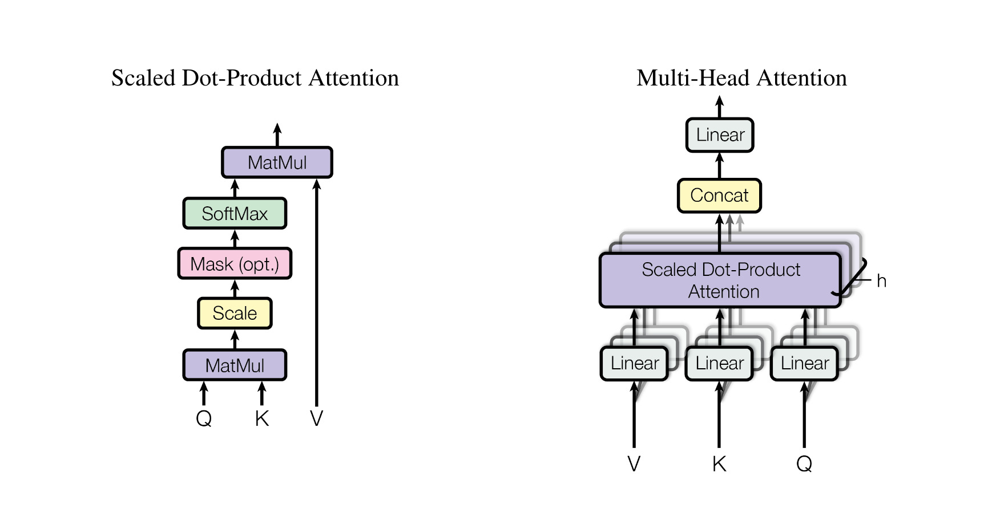
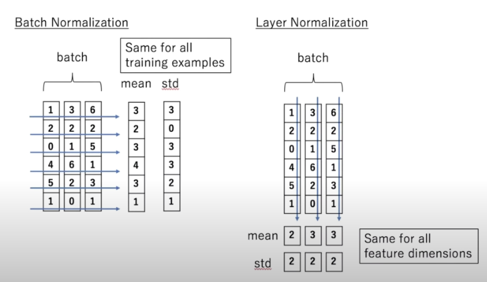

# Transformers model architecture

[Transformers_architecture_image](Artifacts/Transformers_architecture.jpeg)

Left half: Encoder
Right half: Decoder

Both encoder and decoder are composed of a stack of $N_x = 6$ identical layers.
xx

## Encoder

### Input Embedding

Embeddings generated from a given sequence of text , numbers, or any signals
e.g. "My dog eats fish"

### Positional Encoding

Updates the embedding depending on the position of a particular value in a given sequence.
e.g. (not completely valid) "My dog eats fish" "My favourite animal is dog"
In both sentences, the work "dog" has different meaning depending on its position.
Thus position factor must be added in the embeddings

### Multi-head Attention

Each word in the given sequence of text will have 3 vectors:

1. Q (query)
1. K (key)
1. V (value)
   The attention layer takes these 3 vectors and generates an attention vector, which (kind of) determines the weightage of that word in overall sentence.

The attention vector for each word can be calculated using **Scaled-Dot Product Attention**.
But instead of performing a single attention function with $d\_{model}$ dimensions, to get benefit of parallelisation, Multi-Head Attention is performed. The attention is calculated in $h$ parallel processes. The dimensions for each attention layer is kept ( according to the [^1] ) to be $d\_{model} / h$ , so overall computation performed is same.

[^1]: Reference: [Attention is All You Need](https://arxiv.org/abs/1706.03762)

### Feed Forward

Is just a neural network. a fully connected feed-forward network, which is applied to each position separately and identically. This consists of two linear transformations with a ReLU activation in between.

### Add and Normalisation

Normalises the values , either batchwise or layer wise

## Decoder

Contains all the layers (except Input Embedding) present in [Encoder](#encoder). Layers are similar. The layers unique to decoder are:

### Output Embedding

Output of the previous layer ($N-1 ^{th}$ layer from the stack)
Output embeddings are offset by one position, also masking is done before Multi-Head Attention layer. This ensures that the predictions for position $i$ can depend only on the known outputs at positions less than $i$.

### Linear and Softmax

Linear layer is again a [Feed Forward](#feed-forward) layer which converts the attention vectors into a vector of dimension suitable $d\_{model}$. Softmax layers outputs the probabiilties of the next possible word / value in the generated sequence

## Further Reading

\#todo

1. MQA vs GQA: <https://towardsdatascience.com/demystifying-gqa-grouped-query-attention-3fb97b678e4a>

1. GQA: Training Generalized Multi-Query Transformer Models from Multi-Head Checkpoints — <https://arxiv.org/pdf/2305.13245.pdf>

1. MQA: Fast Transformer Decoding: One Write-Head is All You Need — <https://arxiv.org/abs/1911.02150>
