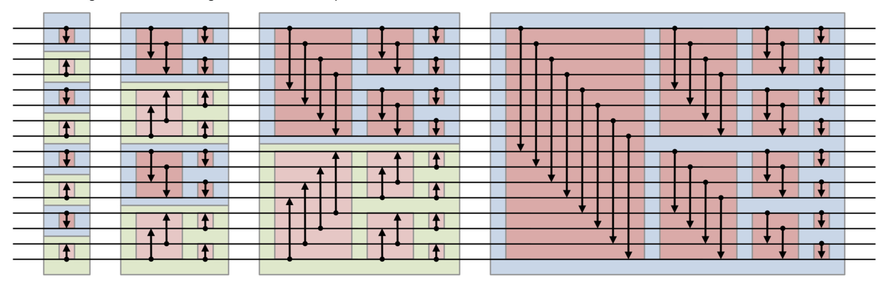

# Bitonic Sort

## Bitonic Sequnce

A **bitonic sequence** is a sequence of numbers in which, at first, the numbers are in strictly increasing order, and after a certain point, they are strictly decreasing till the end of sequence.  
The sequence {1,3,5,7,5,3,1} is a bitonic sequence as the sequence first increases to 7 and then decreases to 1.

## Bitonic Sort Algorithm

A parallel algorithm for sorting

  
[Image ref](https://en.wikipedia.org/wiki/Bitonic_sorter#How_the_algorithm_works):

## References

<https://www.geeksforgeeks.org/bitonic-sort/>
