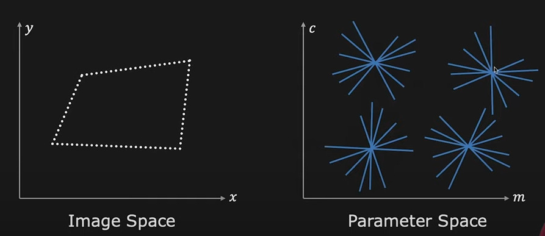
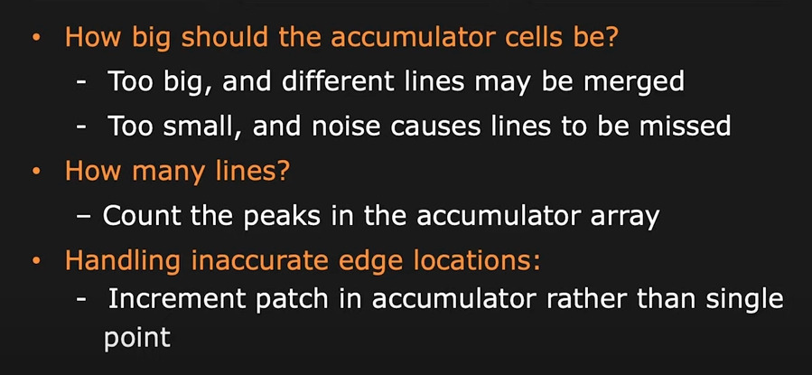
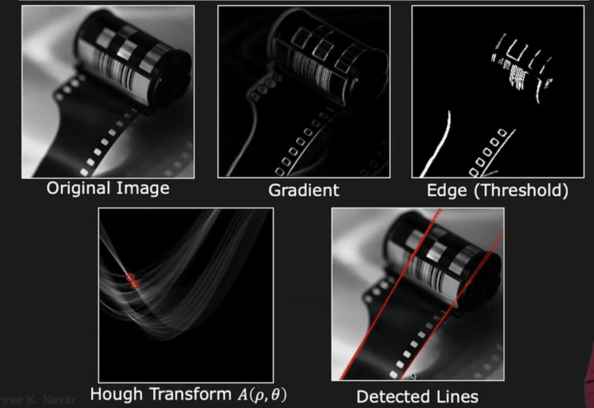
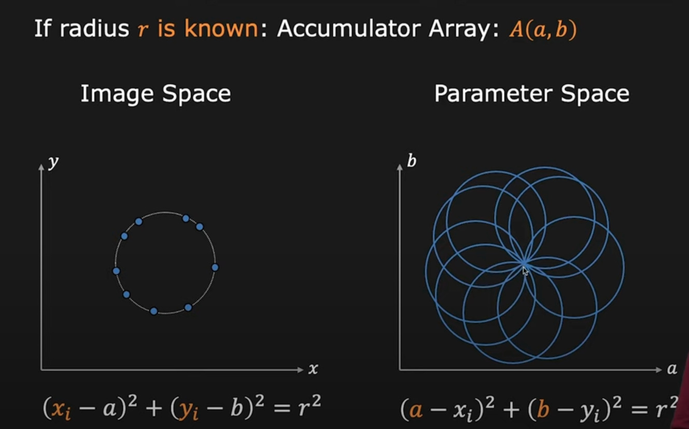
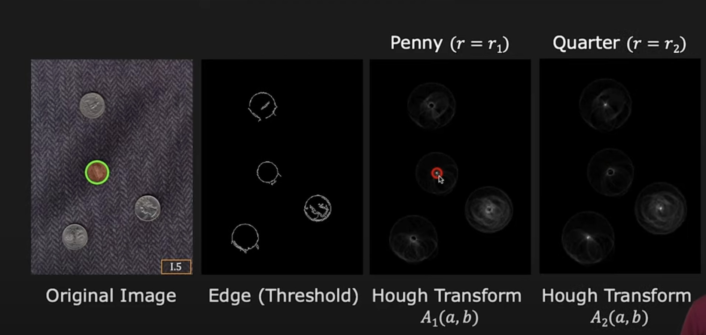
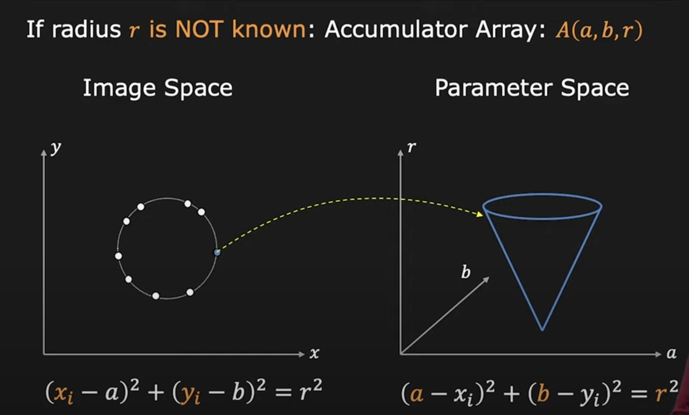

# Hough Transform

## Formulation

Converting image space to parameter space  
In the following example, a line in image space is given by equation

$$y_i = m*x_i + c$$

where $m$ is slope, and $c$ is y-intercept  
Rearranging the terms we get

$$c_i=-m_i*x + y$$

Above equation is also an equation of line, with slop $x_i$ and y-intercept $y_i$

* A ==line== in (x,y) domain (image space) changes to a ==point== in parameter space (m,c)
* A ==point== in (x,y) domain (image space) changes to a ==line== in parameter space (m,c)

This transform can be used to:

1. Detect points in image space which are on the same line
1. Border detection

In following image, the 4 points in parameter space correspond to 4 lines in Image Space, while each concurrent line in parameter space corresponds to each point in image space.

## Issue Using Slope as parameter

Slope of the line ($m$) can be between $\infty \leq m \leq \infty$ ($\infty$ when line in image space is vertical)  
Its not possible to represent infinity (or even such large values) in computer  
More memory and computation required

## Using radius and orientation as parameters

Represent the line in Image Space as

$$ x*sin(\theta) - y*cos(\theta) + \rho = 0 $$

Here, **Orientation** ($\theta$) is finite: $0 \leq \theta \lt \pi$  
**Perpendicular** **distance** from origin ($\rho$) is finite (can not be greater than size of the image itself)

## Hough Transform Mechanics

Accumulator Array: A discrete matrix in parameter space, used to map the array

Here is example of real image processed with Hough Transform.

 > 
 > **NOTE**: Hough transform can only be used to **know the exact location of the edges in the input image**. In below example, Edge detection (with threshold) is performed on the Original Image, then it is passed to Hough Transform.

## Hough Transform: Circle Detection

Similar to line detection

* A ==circle== in (x,y) domain (image space) changes to a ==point== in parameter space (m,c)
* A ==point== in (x,y) domain (image space) changes to a ==circle== in parameter space (m,c)

### Using Gradient Information in Circle Detection

### Circle Detection when Radius is unknown

In this case, in parameter space there are 3 unknown variables: a , b and r

## Rolling Hough Transform

Performing Hough Transform over a large image, on a rolling window ( similar to convolution, or sliding median )  
This is very computationally heavy operation, because of rolling window, but can be parallelised using GPU

## References

1. [Youtube Lecture](https://youtu.be/XRBc_xkZREg)
