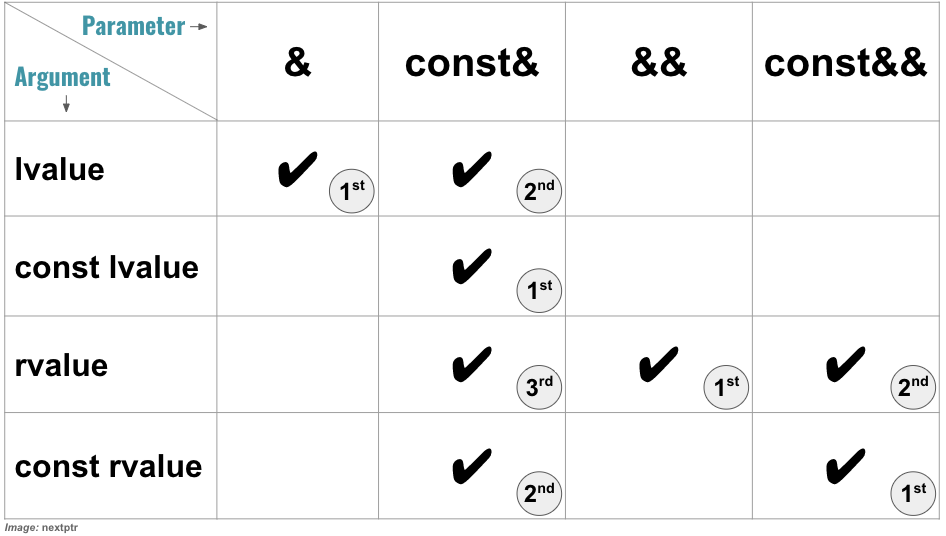

# Copy and Move Semantics

## Things to understand

1. lvalue, xvalue, prvalue  
   <https://en.cppreference.com/w/cpp/language/value_category>  
   on the same note, std::move : <https://en.cppreference.com/w/cpp/utility/move>

1. implicit declaration/deletion of copy and move constructors  
   <https://en.cppreference.com/w/cpp/language/copy_constructor>  
   <https://en.cppreference.com/w/cpp/language/move_constructor>  
   <https://en.cppreference.com/w/cpp/language/overload_resolution>

1. copy elision <https://en.cppreference.com/w/cpp/language/copy_elision>

1. MUST READ. std::move on const lvalue. [ref](https://www.nextptr.com/tutorial/ta1211389378/beware-of-using-stdmove-on-a-const-lvalue)

## What I learned after wasting 2 days on same thing

To summarise:  
**A const valued argument can not be passed to a 'non-const' valued parameterised method**

Please refer to the code examples which also include comments for better understanding:

* [rvalue and lvalue](https://github.com/maneesh29s/just-cpp-things/blob/main/src/lvalues_rvalues.cc)
* [move semantics 1](https://github.com/maneesh29s/just-cpp-things/blob/main/src/move_semantics_1.cc)
* [move semantic 2](https://github.com/maneesh29s/just-cpp-things/blob/main/src/move_semantics_2.cc#)

This image is really important:

  
Ref: <https://www.nextptr.com/tutorial/ta1211389378/beware-of-using-stdmove-on-a-const-lvalue>

Since Passing by reference is like passing a `* const`  , same rules are also applicable to pointers

Literals are converted to equivalent primitives  
String literals, can be converted to `const char*` (recommended) or `char *` (deprecated)

<https://en.cppreference.com/w/cpp/language/string_literal>
