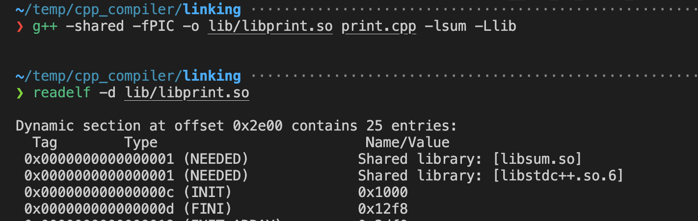
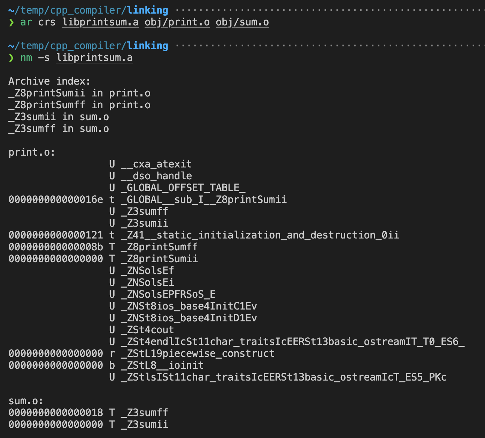

# C++ Compilation and Linking

Github Repo containing helper code: [cpp-linking](https://github.com/maneesh29s/cpp-linking)

## Some headsup

Steps in compilation: pre-process -> compile -> assemble -> link  
assemble step creates a binary object file (something `.o`)  
The linker (`man ld`) is automatically invoked by  the compiler  
The purpose of linker is to link different object files, shared libraries etc.  
The link step results in the creation of an (in linux) ELF file (executable and linkable file)

 > 
 > If you pass `-c` (assemble), `-S` (compile)  or `-E` (pre-processor) flags to `gcc`, **Linker will not be invoked at all**

that's enought context! moving on…

## Object files

When you pass `-c` flag to gcc, it will compile or assemble the source files, but do not link. The linking stage simply is not done. The ultimate output is in the form of an object file for each source file.

`-static` option is use to force compiler to NOT use shared libraries  
Why would you do it? maybe you need to use your self compiled object files instead of shared object files present in some other location  
**At least I have not seen a practical usecase** for `-static`  
But good to rememeber.

## Static libraries

`ar` tool is used to generate static libraries from object files (output of `gcc -c`)  
Possible to create 1 static library from 1 object file.  
You can bundle multiple object files into a single static library.  
e.g.  
`ar rcs libfoobar.a foo.o bar.o`

## Shared libraries

`LIBRARY_PATH` env must contain the paths of the location of where the shared library files are located. This variable is used at **compile time**.  
The path to the libraries can also be specified with `-L <path>` option to the gcc compiler  
Even after the path is set, we **must pass the names** of all the libraries required using `-l(name)` (if library name is `lib(name).so`) or by using the actual file name.

`LD_LIBRARY_PATH` env must contain the paths of the location of where the shared library files are located.  
This variables is used at **run-time** by `ld.so` (linux dynamic runtime linker) to load those libraries into RAM when the program runs.  
**In MacOS**, the dynamic linker `dyld` uses `DYLD_LIBRARY_PATH` variable to search for libraries.

`-shared` is what you need to use to tell compiler to generate a shared library

From [ld.so(8)](https://man7.org/linux/man-pages/man8/ld.so.8.html)  
Linux binaries require dynamic linking (linking at run time) unless the -static option was given to [ld(1)](https://man7.org/linux/man-pages/man1/ld.1.html) during compilation.

## Undefined symbols in shared libraries in linux

The gnu `gcc ld` linker, default in linux, **will report errors** for any undefined symbols referenced in shared libraries if the linker is being **used to create an executable**, but it **will allow undefined symbols** them if the linker is being used to **create a shared library**.  
While the llvm `clang ld` linker (the one used in macos), will also report errors for any undefined symbols for shared libraries.

As per [ld(1)](https://man7.org/linux/man-pages/man1/ld.1.html), The reasons for allowing undefined symbol references in shared libraries specified at link time are that:

* A shared library specified at link time may not be the same as the one that is available at load time, so the symbol might actually be resolvable at load time.

You can force compiler to resolve all undefined symbols OR throw an error, by passing the `--no-undefined` (or `-z defs`) flag  
Then you must pass appropriate shared libraries on which to be compiled library is dependent on

## The sequence of the arguments matter

<https://stackoverflow.com/questions/40603575/why-does-the-order-of-passing-parameters-to-g-matter>

"If object file or shared library `A` depends on a shared library `B`, then `A` must come before `B` on the command line"

Linker scans through the passed shared libraries sequentially.  
At each **shared library** the linker will check if there are any **previously undefined symbols** that could be resolved.  
Linker will discard the shared library if it can not be used to resolve any previously undefined symbols, and move on to the next library / object file in the sequence.

### linking shared libraries and static objects (or cpp source files)

````cpp
g++ -lsum -lprint main.o
# or
g++ -lsum -lprint main.cpp
````

linker will scan the libraries `sum` and `print` first, notice that there aren't dependencies on these library, no symbols from the libraries are needed, so it will discard them and continue with the `main` object or source file. Then it can not resolve the symbols in cpp-main object file, and linker will throw error.  
Once you change the order i.e.

````cpp
g++ main.o -lsum -lprint
````

In above case, the linker will be able to resolve the undefined symbols referenced by the `main` object file

### within shared libraries

If `print` depends on `sum` AND `readelf -d libprint.so` shows `libsum.so` as a dependency, then the position of `-lsum` does not matter.  
Depending on position, at first linker may discard `sum` library, but later when linker sees that `print` explicitly depends on `sum`, it will again load `libsum.so` based on the `-lsum` argument.

 > 
 > Ideally in such cases you should not even pass `-lsum`, rather you should pass `-Wl,-rpath-link` option to the compiler (refer [this](#secondary-dependency-issue-in-gnu-linker))



If `-lsum` was not passed during the compilation of shared library `print`, then `readelf -d libprint.so` will now show `libsum.so` as an explicit dependency.  
In such case, `-lsum` must come after `-lprint`.

### within static objects

If all the object files to be linked are static (i.e. no shared libraries being used), then **the order does not matter.**

### Precautions

Generally such **things are handled by cmake** or other build tools, so we are not aware of this  
But when compiling mannually, or when writing a Makefile, ideal flow should be:

````bash
compiler -> compiler_options -> file_to_be_compiled -> object_files -> shared_libraries
````

## Why ld linker has to locate shared libraries if it really does nothing with them?

[Original discussion](https://stackoverflow.com/questions/24598047/why-does-ld-need-rpath-link-when-linking-an-executable-against-a-so-that-needs/35748179#35748179) - good read first answer

Following paragraph is slightly generalised

if I understand linking process correctly, *ld* actually does not need to locate even the shared library. It could just ignore all unresolved references in `main-app` hoping that dynamic linker would resolve them when loading shared libraries at runtime.  
But if *ld* were doing in this way, many "undefined reference" errors would not be detected at link time, instead they would be found when trying to load `main` in runtime.  
So *ld* just does additional checking that all symbols not found in `main-app` itself can be really found in shared libraries that `main-app` depend on.  
So if `main-app` program has "undefined reference" error (some variable or function not found in `main-app` itself and neither in shared library), this becomes obvious at link time, not just at runtime. Thus such behavior is just an additional sanity check.

## Secondary Dependency issue in GNU linker

Read "# Proper handling of secondary dependencies" from this article: <https://www.kaizou.org/2015/01/linux-libraries.html>  
Supporting code files: <https://github.com/dacorvo/linux-shlib-link-samples>

TLDR: If app depdens on libA , but libA depends on libB, and we don't care to mention `-lB` when linking app with libA,  
then we at least need to pass `-Wl,-rpath-link=<path to dir containing libB>` to the compiler when compiling app A.  
Otherwise linker will throw error like "libB needed by libA not found"

## Some linux command I came across

`ld` : compile time linker, used by gcc/llvm to generate executable by linking objects  
`ld.so` : the linux dynamic linker. contains description of how search takes place  
`ldd` : check runtime dependencies (shared libraries) of an executable/library. On mac: `otool -L`  
`pldd <pid>` : check loaded shared libraries by a running process  
`ar` : creates, modifies, and extracts from archives. An *archive* is a single file holding a collection of other files in a structure that makes it possible to retrieve the original individual files (called *members* of the archive). This is commonly used to statically combine libraries, creating a single file.  
Run `nm -s` on the created archive to see the details. The `-s` options shows **Archive index** i.e. "a mapping (stored in the archive by ar or ranlib) of which modules contain definitions for which names"



`readelf` : reads ELF files. Need to specify which section to read. `readelf -d` to read the dynamic linking section.  
`objdump` :  used to display all the information in an object binary file.  
`strings` : list all the printable strings in a binary file.  
`strip` : deletes the symbol table information.

`void *dlopen(const char *filename, int flags)` :  a C++ library function which opens a shared object

## linking in mac os

`man dyld` : the dynamic linker for mac. Read "DYNAMIC LIBRARY LOADING" section

`man otool` : object manipulation tool

## References

1. <https://gcc.gnu.org/onlinedocs/gcc/Option-Summary.html>
1. <https://gcc.gnu.org/onlinedocs/gcc/Overall-Options.html>
1. <https://gcc.gnu.org/onlinedocs/gcc/Invoking-G_002b_002b.html>
1. <https://gcc.gnu.org/onlinedocs/gcc/Link-Options.html>
1. Optional: <https://gcc.gnu.org/onlinedocs/gcc/Assembler-Options.html>
