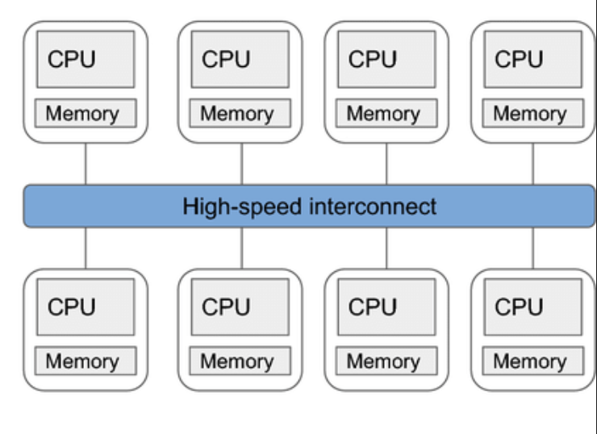

# Multi-core and Multi-CPU systems

## MIMD Architecture

[MIMD](flynns_taxonomy.md) [Execution Model](programming_and_execution_model.md) consists of two different types of architecture:

### Shared Memory MIMD architecture

**Characteristics:**

1. the physical RAM is shared between processors
1. data and address buses to the RAM are shared
1. processors can communicate with each other using the shared memory

### Distributed Memory MIMD architecture

**Characteristics:**

1. the physical RAM is not shared
1. each processor has its own data and address bus
1. processors can communicate with each other using networking

## Multi-core systems

These are example of **shared memory MIMD architecture**  
All modern CPUs are multi-core in nature.  
A CPU die goes into a single slot into the motherboard. Each die has multiple processors or "**cores**". All cores use the same power, cooling, IO etc.

Above figure shows Overview of components of a modern x86_64 CPU:  
These CPUs have following characteristics:

1. **Multiple CPU cores**: A CPU die consists of multiple cores. Each core has separate set of registers, execution units, L1 and L2 cache. The OS can schedule multiple threads (from same or different process) across all the available cores, and they can be run simultaneously. Figure 1 shows 3 cores (Core 0, Core 1 and Core 2), but modern high-end CPUs have ≥8 cores.

1. **Two logical cores per CPU core**: [Simultaneous multithreading (SMT)](simultaneous_multi_threading.md) allows multiple threads to be run inside a single CPU core, sharing the execution engine. Figure 1 shows the components inside a core when the CPU supports SMT. Each logical core has its own set of registers (general purpose registers, vector registers etc.). OS can schedule the threads independently at each logical core. SMT helps to get better CPU utilization.

 > 
 > Intel’s SMT implementation is known a [Hyper-threading Technology](https://www.intel.com/content/www/us/en/gaming/resources/hyper-threading.html). AMD also allows SMT.

## Multi-CPU system

These are example of **distributed memory MIMD architecture**  
Examples of such systems are supercomputers or CPU clusters in warehouses, where multiple CPUs (as in CPU dies) are connected to each other via some network, such that they can execute a same program in parallel.

Typically such clusters employ **controller/worker** architecture, where one "controller" CPU co-ordinates the jobs that has to be scheduled across rest of the "worker" CPUs.

For inter-CPU communication, high-speed networks such as [Infiniband](../IO/Infiniband.md) or 100GbE are used.

  
Image [ref](https://passlab.github.io/OpenMPProgrammingBook/MultiCoreMultiCPU/1_MIMDArchitecture.html):

## Further Read

1. <https://passlab.github.io/OpenMPProgrammingBook/MultiCoreMultiCPU/1_MIMDArchitecture.html>
