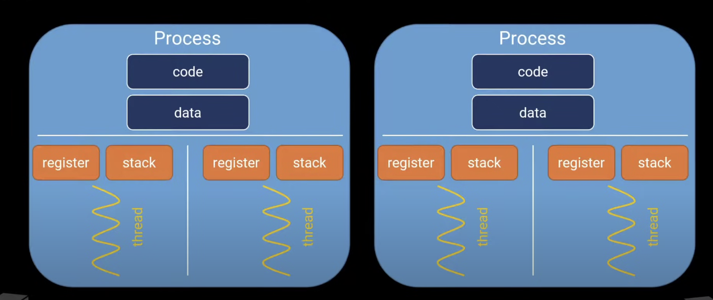

---
aliases:
- Processes and Threads
- Process
- Thread
- Program
author: Maneesh Sutar
date: 2023-11-18
tags:
- public
title: Processes and Threads
---

# Processes and Threads

## Program

==A program is an executable file, containing instructions and some data.==  
Usually it is a binary executable file, or even text code in case of interpreted languages.

## Processes

==A process is an running instance of a program==

==Each process has its own virtual memory address space.==  
A process memory consists of:

1. Code memory
1. Data memory (global and static variables)
1. Heap (for dynamic memory allocations)
1. Process Stack
1. Process Control Block

In Linux, a running process can spawn a new process using system calls [fork(2)](https://man7.org/linux/man-pages/man2/fork.2.html) and [execve(2)](https://man7.org/linux/man-pages/man2/execve.2.html)

The Linux OS keeps track of all the running processes using a [Kernel Process Table](https://exposnitc.github.io/os_design-files/process_table.html)

The new process has saperate virtual memory than the process that spawned it initially.

## Threads

Thread is a lightweight process.

==Thread is the smallest unit of a process that a can run on a CPU core==.

Each process has at least 1 thread.

==All the threads spawned from a process shares the virtual memory address space of the parent process.==

Each thread has its own:

1. Thread Stack
1. Thread Control Block

Each thread shares:

1. Code memory
1. Data memory
1. Heap
1. PCB

Threads are supported by nearly all operating systems and can be created with system calls.

In Linux, a process can spawn a new thread by using system calls like [clone(2)](https://man7.org/linux/man-pages/man2/clone.2.html) and specifying flags like `CLONE_THREAD` or `CLONE_VM`.
