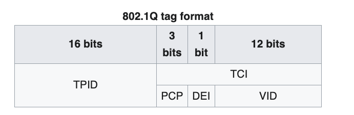

# Virtual LANs

*Virtual LAN (VLAN)* is a concept in which we can ==divide the devices logically on== **layer 2 (data link layer)**

Typically, layer 3 (Network Layer) ==divide the network== based on **Broadcast Domains** i.e. when broadcasting, only the devices in a same broadcast domain (subnet) will receive the packets

==Broadcasting is limited to switches== as ==Routers don't forward broadcast packets.==

A single switch can have multiple VLANs

A modified ethernet frame, called **IEEE 802.1Q Frame Format** is used to send the information regarding VLANs along with regular data.

## IEEE_802.1Q

Supports [virtual local area networking](https://en.wikipedia.org/wiki/Virtual_local_area_network "Virtual local area network") (VLANs) on an [IEEE 802.3](https://en.wikipedia.org/wiki/IEEE_802.3 "IEEE 802.3") [Ethernet](https://en.wikipedia.org/wiki/Ethernet "Ethernet") network

802.1Q adds a 32-bit field between the source [MAC address](https://en.wikipedia.org/wiki/MAC_address "MAC address") and the [EtherType](https://en.wikipedia.org/wiki/EtherType "EtherType") fields of the original frame

## References

1. <https://www.geeksforgeeks.org/virtual-lan-vlan/>

1. <https://en.wikipedia.org/wiki/IEEE_802.1Q>
