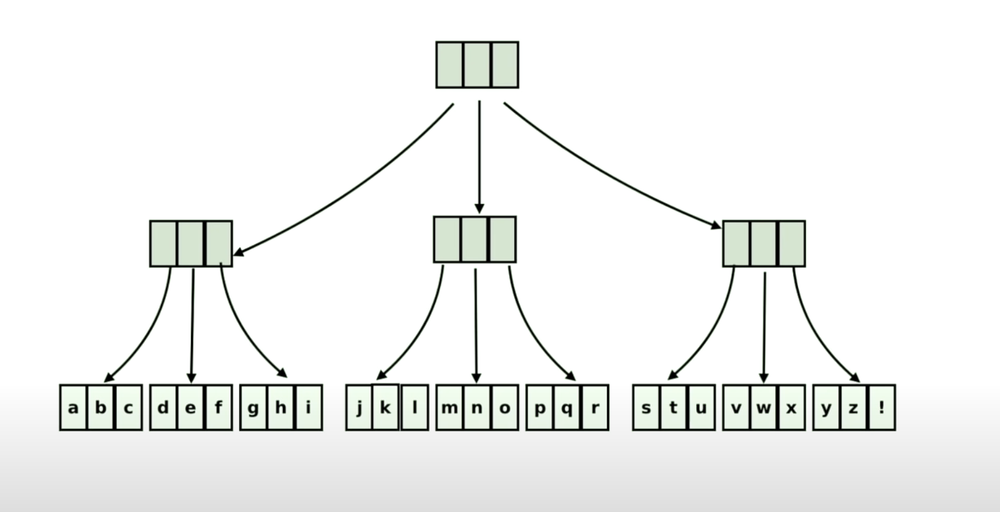

# Persistent Data Structures

Used in [Functional Programming](functional_programming.md) languages for efficient implementation of **immutable data structures**

This is an example of a Persistent Array  
Looks like an m-tree

**Elements at the leaf are the actual array elements**

Say we want to replace n with Q.

In this case, we only need to **make copies of only 3 blocks** (highlighted in red), and rest of the blocks will be reused in the new variable.

In practical cases, an **m-tree with 32 elements** per block are used.  
Calculate how many elements it can hold with just an height of 3
