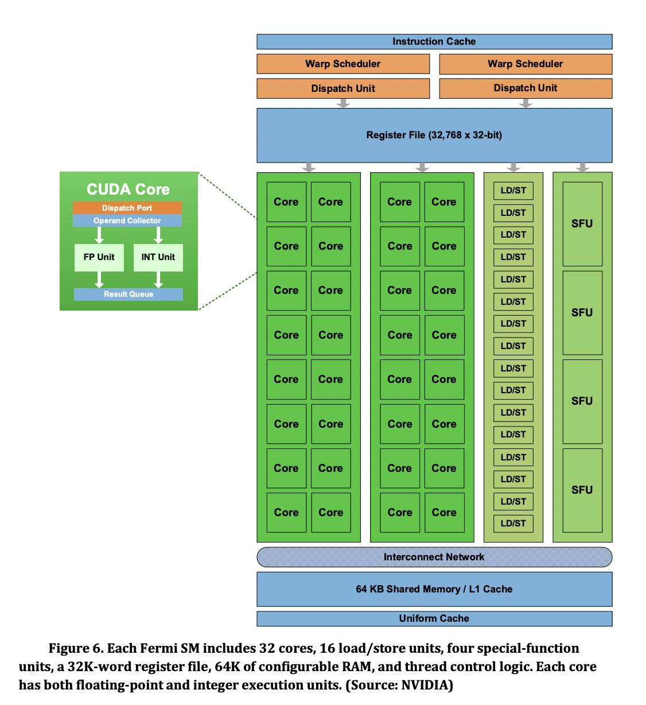
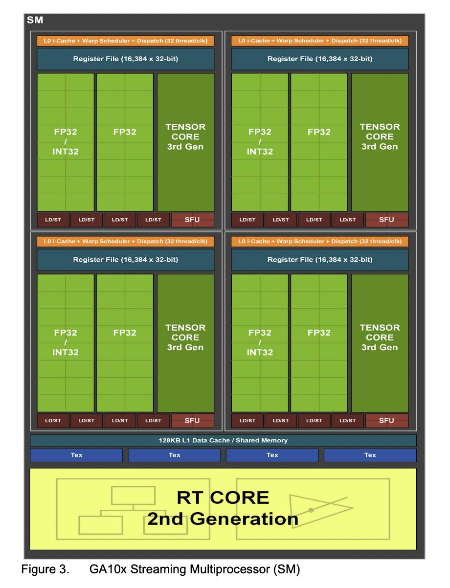

# Nvidia over the years

[GTX 200 Architecture](https://www.nvidia.com/docs/io/55506/geforce_gtx_200_gpu_technical_brief.pdf)

The OG Tesla Architecture for GPGPU/ HPC:  
<https://www.cs.cmu.edu/afs/cs/academic/class/15869-f11/www/readings/lindholm08_tesla.pdf>

 > 
 > Nvidia retired the Tesla brand in May 2020, reportedly because of potential confusion with the brand of cars.\[1\] Its new GPUs are branded Nvidia Data Center GPUs\[2\] as in the Ampere-based A100 GPU.\[3\]

Nvidia FERMI  
[Nvidia "Fermi" External Contract Writeup](https://www.nvidia.com/content/pdf/fermi_white_papers/p.glaskowsky_nvidia%27s_fermi-the_first_complete_gpu_architecture.pdf)  
[Fermi Whitepaper](https://www.nvidia.com/content/pdf/fermi_white_papers/nvidia_fermi_compute_architecture_whitepaper.pdf)  
NVIDIA Fermi contains

1. **16 SMs**
1. 32 cores per SM, total **512 cores**
1. Each core contains a FP unti and INT unit  
   **Interesting thing about Fermi:** Each ==FP32 unit is capabable of also performing double precision operations in 2 clock cycles==. This capability is not observed in later architectures, which always have dedicated FP64 units in them  
   

Kepler Architecture - HPC and Consumer  
<https://en.wikipedia.org/wiki/Kepler_(microarchitecture)>  
<https://www.nvidia.com/content/dam/en-zz/Solutions/Data-Center/tesla-product-literature/NVIDIA-Kepler-GK110-GK210-Architecture-Whitepaper.pdf>  
==Had 192 FP32 and 64 FP64 units per SM==

Maxwell Architecture - HPC and Consumer  
<https://en.wikipedia.org/wiki/Maxwell_(microarchitecture)>  
==Had 128 FP32 and 4 FP64 units per SM==

NVIDIA Pascal GPUs - HPC and Consumer - powering Tesla P100 and GTX 1080  
<https://en.wikipedia.org/wiki/Pascal_(microarchitecture)>  
Comparision: <https://developer.nvidia.com/blog/inside-pascal/>  
<https://www.es.ele.tue.nl/~heco/courses/ECA/GPU-papers/GeForce_GTX_1080_Whitepaper_FINAL.pdf>

[Volta](https://en.wikipedia.org/wiki/Volta_(microarchitecture)) - HPC - Tesla V100 - first gen tensor cores - [architecture pdf](https://images.nvidia.com/content/volta-architecture/pdf/volta-architecture-whitepaper.pdf)  
Compute Capability 7.0 (64 FP32, 64 INT32, 32 FP64 units) [link](https://docs.nvidia.com/cuda/cuda-c-programming-guide/index.html#compute-capability-7-x)  
[Turing](https://en.wikipedia.org/wiki/Turing_(microarchitecture)) - Consumer - RTX 20 series - 2nd gen tensor cores , 1st gen Ray tracing cores - [architecture pdf](https://www.techpowerup.com/gpu-specs/docs/nvidia-turing-architecture.pdf) -  
Compute Capability 7.5 (note there are only 2 FP64 cores)

RTX 30 series GPUs, powered by [Ampere GA10x](https://www.nvidia.com/content/PDF/nvidia-ampere-ga-102-gpu-architecture-whitepaper-v2.1.pdf) architecture (slightly different than GA100 used for A100)  
Each SM in GA10x GPUs contain:

1. **128 FP32 CUDA Cores**
1. **2 FP64 CUDA Cores**
1. **64 INT32 CUDA Cores**
1. 4 third-generation **Tensor Cores**,
1. Four **Texture Units**,
1. one second-generation **Ray Tracing Core**, and 128 KB of L1/Shared Memory  
   All RTX 30 series GPUs have CUDA Compute Capability 8.6 [link](https://docs.nvidia.com/cuda/cuda-c-programming-guide/index.html#compute-capability-8-x)

==Number of SMs vary== in each GPU implementation of GA10x architecture  
RTX 3060Ti has 38 SMs  
RTX 3090 has 82 SMs  
RTX 3090Ti has 84 SMs

**About FP64 Support:** The GA102 GPU (RTX 3090Ti) features 168 FP64 units (two per SM), which are not depicted in this diagram. The FP64 TFLOP rate is 1/64th the TFLOP rate of FP32 operations. The small number of FP64 hardware units are included to ensure any programs with FP64 code operate correctly, including FP64 Tensor Core code

[Nvidia A100](https://images.nvidia.com/aem-dam/en-zz/Solutions/data-center/nvidia-ampere-architecture-whitepaper.pdf) is a server grade GPU powered by NVIDIA Ampere GA100 Architecture  
Each SM in GA100 architecture contains:

* **64 FP32 and INT32** CUDA Cores
* **32 FP64** CUDA Cores,
* 4 Third-generation **Tensor Cores**  
  Nvidia A100 support CUDA Compute Capability 8.0 [link](https://docs.nvidia.com/cuda/cuda-c-programming-guide/index.html#compute-capability-8-x)

Number of SM may vary per implementation  
The NVIDIA A100 Tensor Core GPU implementation of the GA100 GPU includes:

* 7 GPCs, 7 or 8 TPCs per GPC, 2 SMs per TPC, up to 16 SMs/GPC, **108 SMs**
* 5 HBM2 stacks, 10 512-bit Memory Controllers

**About Display capabilities**: from the whitepaper:

 > 
 > Because the A100 Tensor Core GPU is designed to be installed in high-performance servers and data center racks to power AI and HPC compute workloads, it does not include display connectors, NVIDIA RT Cores for ray tracing acceleration, or an NVENC encoder

SM in NVIDIA GA100 Ampere Architecture (used in A100 series)  

Hopper Microarchitecture - HPC - H100  
<https://en.wikipedia.org/wiki/Hopper_(microarchitecture)>

Whitepaper: <https://resources.nvidia.com/en-us-tensor-core/gtc22-whitepaper-hopper>

Datasheet:  

NVIDIA H100 GPU contains total 132 SMs per GPU  
Each SM has (compute capability 9.0 for H100)

* 128 FP32 cores for single-precision arithmetic operations,
* 64 FP64 cores for double-precision arithmetic operations,
* 64 INT32 cores for integer math,
* 4 mixed-precision fourth-generation Tensor Cores supporting the new `FP8` input type in either `E4M3` or `E5M2` for exponent (E) and mantissa (M), half-precision (fp16), `__nv_bfloat16`, `tf32`, INT8 and double precision (fp64) matrix arithmetic (see [Warp Matrix Functions](https://docs.nvidia.com/cuda/cuda-c-programming-guide/index.html#wmma) for details) with sparsity support,
* 16 special function units for single-precision floating-point transcendental functions
* 4 texture units
* 4 warp schedulers

 > 
 > Since the H100 series GPUs (like A100) are supposed to be used for HPC workloads, so they don't have display connector or RT cores.

Ada Lovelace - Consumer - RTX 40 series  
<https://en.wikipedia.org/wiki/Ada_Lovelace_(microarchitecture)>  
Whitepaper: <https://images.nvidia.com/aem-dam/Solutions/Data-Center/l4/nvidia-ada-gpu-architecture-whitepaper-v2.1.pdf>

RTX 4090 GPU (AD102 architecture) contains total 144 SMs  
Each SM contains (compute capability 8.9 for RTX 4090)

1. 128 FP32 CUDA Cores
1. 2 FP64 CUDA Cores
1. 64 INT32 CUDA Cores
1. 16 special function units
1. 4 fourth-generation **Tensor Cores**
1. 4 texture units
1. one third-generation **Ray Tracing Core**
1. 4 warp schedulers.

## References

1. Cuda Architecture capability:  
   Gives info on number of functional units per SM  
   <https://docs.nvidia.com/cuda/cuda-c-programming-guide/index.html#architecture-8-x>  
   GPUs with their Cuda compatibility:  
   <https://developer.nvidia.com/cuda-gpus>
1. All HPC/GPGPU offerings: <https://en.wikipedia.org/wiki/Nvidia_Tesla>
