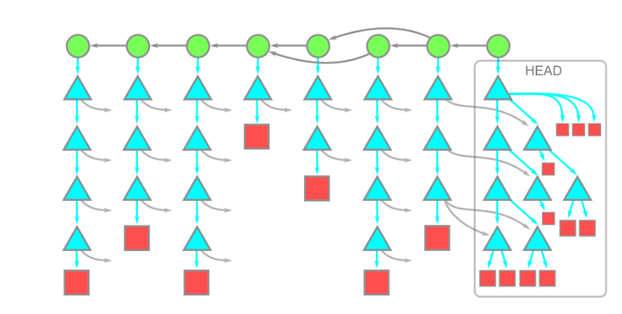

# Git commits, trees and blobs

Ref 1: <https://github.blog/2020-12-21-get-up-to-speed-with-partial-clone-and-shallow-clone/>

Ref 2: <https://github.blog/2020-12-17-commits-are-snapshots-not-diffs/>

[Git objects man](https://git-scm.com/book/en/v2/Git-Internals-Git-Objects)

## TLDR

**All 3 are git objects**

**Commits** are snapshots in time  
Each commit has **Trees** which correspond to directory  
Each Tree has **Blobs** which represent the files

