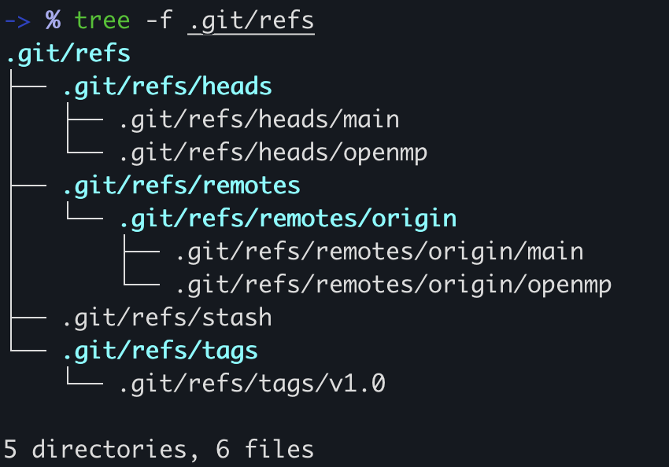
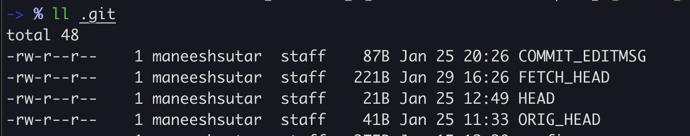
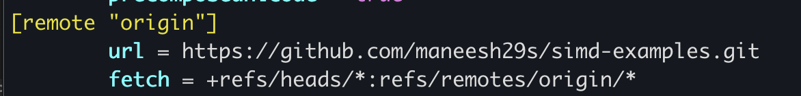
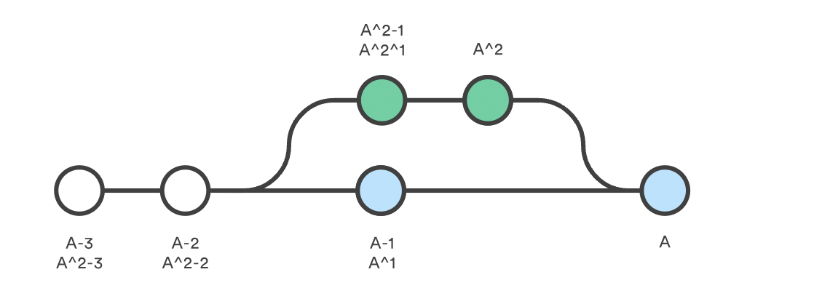
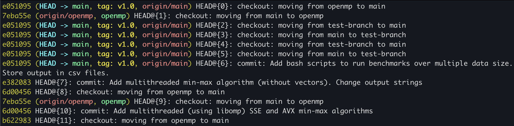

---
aliases:
- git ref
- git reflog
author: Maneesh Sutar
date: 2024-03-03
tags:
- git
title: Git Refs
---

# Git Refs

`git rev-parse <ref>`: returns the SHA id of the `ref`, where `ref` can be tag, branch name, HEAD

A **ref** is an indirect way of referring to a commit. You can think of it as a user-friendly alias for a commit hash. This is Git’s internal mechanism of representing branches and tags[^1]

## Where they are stored?

Refs are stored as normal text files in the `.git/refs` directory.  
`heads` directory contains local branches  
The `remotes` directory lists all remote repositories that you created with `git remote` as separate subdirectories.  
The `stash` file contains the SHA of the tree/object where that stash is stored  
The `tags` directory contains tags instead of branches.

==Each file contains the SHA id of the commit to which it points to==

To change the location of the `main` branch, all Git has to do ==is change the contents of the== `refs/heads/main` file.  
Similarly, creating a new branch is ==simply a matter of writing a commit hash to a new file==

## Packed refs

Git will periodically perform a garbage collection ( `git gc` ) to remove unnecessary objects and compress refs into a single file for more efficient performance

Garbage collector ==moves all of the individual branch and tag files== in the `refs` folder into a ==single file called== `packed-refs` located in the top of the `.git` directory.

## Special Refs

Auto-created by git, present in the top `.git` directory

* `HEAD` – The currently checked-out commit/branch.
* `FETCH_HEAD` – The most recently fetched branch from a remote repo.
* `ORIG_HEAD` – A backup reference to `HEAD` before drastic changes to it.

Some are generated on special scenarios, like

* `MERGE_HEAD` – The commit(s) that you’re merging into the current branch with `git merge`.
* `CHERRY_PICK_HEAD` – The commit that you’re cherry-picking.

These files ==contain different content depending on their type and the state== of your repository. e.g.  
`HEAD` typically contains a **symbolic ref**, which is simply a reference to another `ref`  
But when in **detached mode**, `HEAD` will contain the SHA id of the commit. ==This is how git knows that repo is in detached mode==

## Refspecs

A refspec ==maps a branch in the local repository to a branch in a remote repository==.

A refspec is specified as `[+]＜src＞:＜dst＞`.

Default refspecs can be found in `.git/config` file

Here, fetch refspec contains `*` , which means, by default (when running only `git fetch` without any options) it will fetch and start tracking all remote branches  
==We can specify the default tracking branch here if we don't want all branches to be tracked==  
Similar options  
See [git-config](https://git-scm.com/docs/git-config) for more

## Relative refs

The `~` character lets you reach parent commits. For example, the following displays the ==grandparent== of `HEAD`: `git show HEAD~2`

The `~` character ==will always follow the *first* parent== of a merge commit.

For merge commits, there are more than 1 parents.  
If you want ==to follow a different parent, you need to specify that parent's number== with the `^` character, then move in that parent's history using `~` character

For example, if `HEAD` is a merge commit, the following returns the ==grandparent of the second parent== of `HEAD`.: `git show HEAD^2~2`

## The reflog

**Git's safety net**  
==Records a change in the HEAD of the repo== across the whole repo

# References

1. <https://www.atlassian.com/git/tutorials/refs-and-the-reflog>

1. <https://git-scm.com/docs/git-config>
