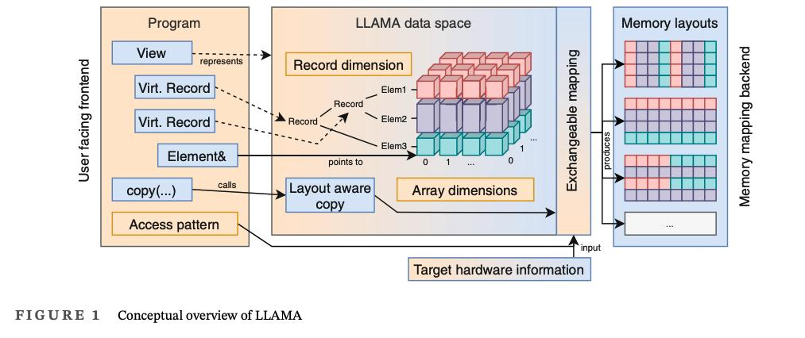

# Low-Level Abstraction of Memory Access

LLAMA is a cross-platform C++17/C++20 header-only template library for the abstraction of data layout and memory access.

## Some points from the paper

The efficiency of parallel programs thus increasingly relies on maximizing data throughput by -

* increasing data locality
* choosing data layouts for efficient parallel access

Specialized compute and memory hardware architectures to fight the increasing gap between compute and memory capabilities:

* Google’s tensor processing units (TPUs)
* the PEZY SC many-core microprocessors
* Fujitsu’s A64FX processor powering the Fugaku supercomputer
* near-memory and in-memory computing architectures
* DRAM modules with additional SRAM caches for their row buffers

## Design

The design of LLAMA centers on an ==abstract description of a data structure== containing ==compile time and runtime information==, which is instantiated with a separately configurable memory layout.

### Data Space

* In order to ==separate data structure access and physical memory== layout LLAMA introduces an abstract data type called **data space**.
* The data space is an ==hyper-cubic index set== described by the **record dimension** and one or more **array dimensions**
* **Record Dimension**: The record dimension consists of a hierarchy of names and describes nested, structured data, much like a `struct` in C++.
* **Array dimensions**: zero-based integral ranges
* Programs are written against this abstract data space, and they are not aware of how that data is actually stored

### View and Virtual record

Programs can refer to the data space via a **view**, and to subparts of the data space via **virtual records**, which behave like references to structs, to individual elements via real l-value references.

### Exchangeable Mapping

* To allow a flexible specification of a memory layout, the data space is materialized via an exchangeable mapping that ==describes how the index set of the data space is embedded into a physical memory==.
* Mapping is ==exchangeable at compile time==
* For ==further optimization==, this mapping can be augmented with additional information from the **program’s access pattern** and **target hardware information**.
* Due to a mapping encapsulating the full knowledge of a memory layout, ==LLAMA supports layout-aware copy operations between instances of the same data space but with different mappings==

## Describing a data structure

Refer to [this](https://llama-doc.readthedocs.io/en/latest/pages/llama_vs_cpp.html) web page to see LLAMA equivalent of a similar data structure in C++

## Common Software Design Patterns in LLAMA and ADIOS

Both provide Abstraction layer between how we define data structures in our code, to how the data is actually stored in memory / disk  
Though ADIOS is for disk IO, and LLAMA is for memory

Both provide custom ways, so that user can define their own data types (ADIOS: Variable, LLAMA: Record)

Both have a feature of (kind of) lazy evaluation. LLAMA delays resolving the actual memory address of a data, while ADIOS uses deferred read/write

LLAMA provides different Mapping techniques between Abstract Layer and Physical memory, while ADIOS provides different Engine types.
