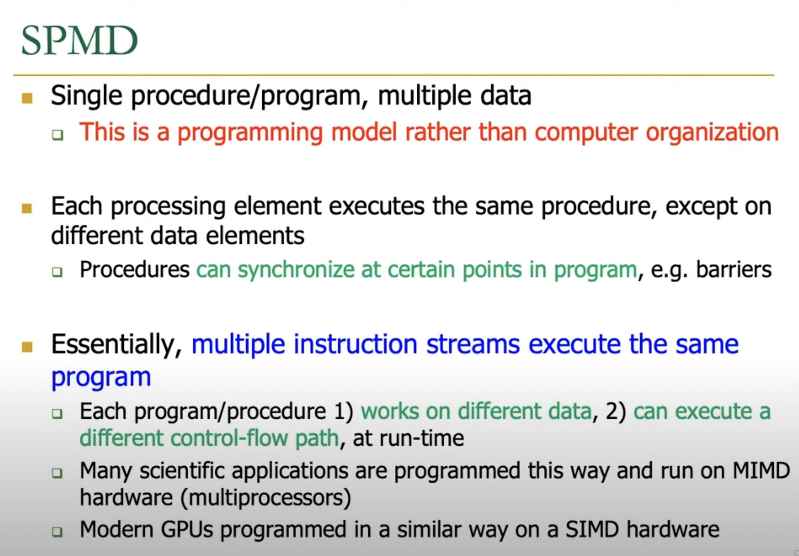

---
aliases:
- SPMD
author: Maneesh Sutar
created: 2024-03-02
modified: 2024-09-28
tags: []
title: SPMD
---

# SPMD

**SPMD is a programming model, not hardware level organisation** (like SIMD or MIMD)  
See [Programming Model](../ComputerArchitecture/programming_and_execution_model.md)

**NOTE:** A "for loop; running over 1M iterations; performing X operatios in each iteration" is **not an example of SPMD** programming, but Sequential Programming.  
"A multi-threaded application; ran over 1M threads; each thread performing X operations" is an example of SPMD programming.

The **SIMT** programming model of GPUs is basically **SPMD** implemented on **SIMD** hardware (array and vector processors).

Even before GPUs or SIMD processors (1990s), people used to use **SPMD** programming model to run the same program across multi-processors (MPI applications)  
But running same program across different processors has an overhead of instruction cycle (fetch, decode, execute).

Since underlying hardware of a GPU is a SIMD, ==GPUs are much more efficient, even when using the same programming model.==

## SPMD vs SIMD programming models

**SPMD** differs from **SIMD** programming in the same way a program and an instruction are different.

Program is a group of smaller commands, where each command is an Instruction.  
Instructions are tied to the underlying architecture. But a program is not.

Also, **SPMD** does not guarantee that same instructions will be performed on all the data elements, since different execution path is possible due to control flow.  
**SIMD** guarantees that same instruction is performed on all data elements
