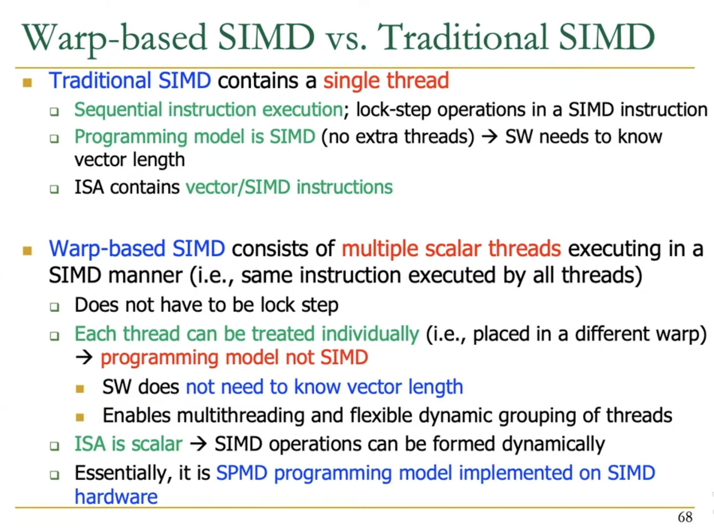
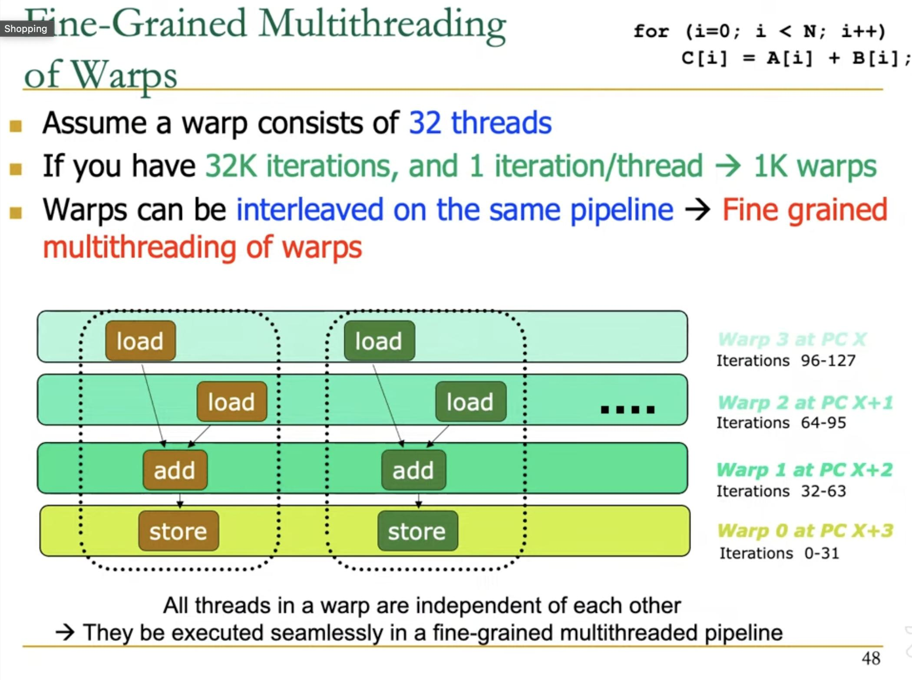
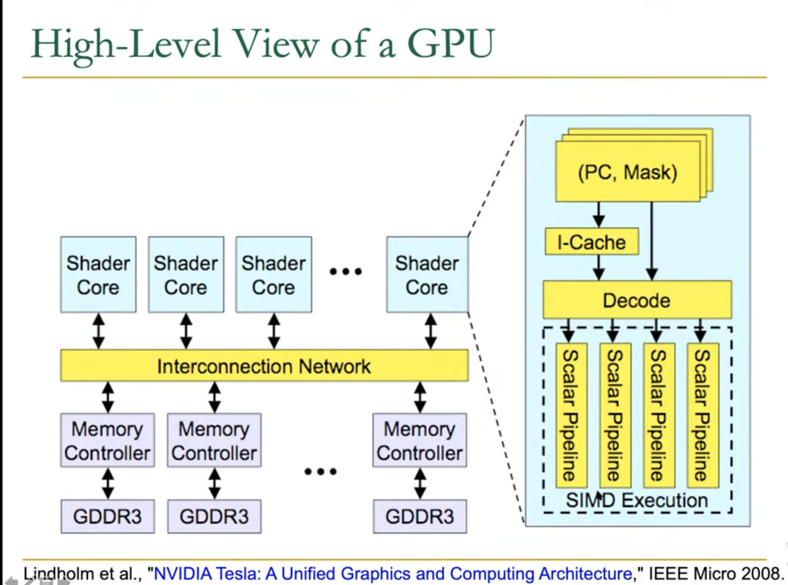
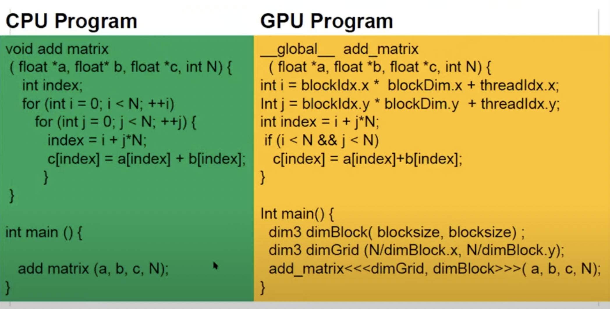

# Working of GPU

## Basic idea

1. Run thousands of numerical computation (floating point addition/multiplication) simultaneously across thousands of execution units
1. Avoid complex logics (conditionals, loops)

## Internals

GPUs are SIMD machines underneath  
However, ==the programming is done using Threads==, not SIMD instructions (see [Programming Model](../ComputerArchitecture/programming_and_execution_model.md))

Same program (not necessarily an instruction) is executed across ==multiple threads==, each thread ==operates on different piece of data==  
The programming model is very similar to Single Program Multiple Data (SPMD)  
But NVIDIA calls this programming model as **Single Instruction Multiple Thread (SIMT)**

### SIMD vs SIMT

**SIMD**: ==A single sequential instruction stream of SIMD instructions== → each instruction specifies multiple data inputs  
Instructions like VLD, VLD, VADD, VST  
VLEN specifies the size of simultaneous vector operations, fixed by hardware

**SIMT**: ==Multiple instruction streams of scalar instructions== → threads grouped dynamically into **warps**  
Scalar instructions like LD, LD, ADD, ST  
NumThreads specifies ==number of threads per warp, fixed by GPU==

  
[Image Reference](https://safari.ethz.ch/digitaltechnik/spring2023/lib/exe/fetch.php?media=onur-ddca-2023-lecture20-gpu-afterlecture.pdf)

As per [GTX 200 GPU Tech Doc](https://www.nvidia.com/docs/io/55506/geforce_gtx_200_gpu_technical_brief.pdf)  
"SIMT improves upon pure SIMD (single instruction, multiple data) designs in both performance and ease of programmability. Being scalar, SIMT has no set vector width and therefore performs at full speed irrespective of vector sizes. In contrast, SIMD machines operate at a reduced capacity if the input is smaller than the MIMD or SIMD width. SIMT ensures the processing cores are fully utilized at all times. From the programmer’s perspective, SIMT also allows each thread to take on its own path. Since branching is handled by the hardware, there is no need to manually manage branching within the vector width."

### Advantages of SIMT

1. Each thread ==has its own context== (can be treated/restarted/executed independently). Can execute each thread on any type of scalar pipeline.
1. A set of threads executing the same instructions are grouped into a **warp (wavefront in AMD)** ==by the hardware==.  
   Can ==group threads into Warps flexibly== i.e. can group threads that are supposed to truly execute the same instruction.  
   Dynamically obtain and maximize the benefit of SIMD processing

### Fine-grained multithreading (FGMT) with Warps

 > 
 > **GPU act like combined vector and array processor**

The warps themselves ==can be pipelined== so that each warp runs on a different functional unit at a given time

Each warp contains 32 threads (numThreads is GPU specific).  
Assume that there are 32 parallel scalar lanes available (each lane contains all functional units)

  
[Image Reference](https://safari.ethz.ch/digitaltechnik/spring2023/lib/exe/fetch.php?media=onur-ddca-2023-lecture20-gpu-afterlecture.pdf)

The above diagram ==shows situation (approx) at 4th cycle==.  
Warp0, initiated at cycle 0, has already passed through 2 loads and 1 add stages, and now its performing store.  
Similarly, Warp1, initiated at cycle 1, has passed through 2 load operations and now its running add.

Following diagram shows High-Level view of a GPU, where a shader core contains 4 scalar pipelines aligned in parallel.  
This is equivalent to ==4 lanes in a array + vector processor==

  
[Image Reference](https://safari.ethz.ch/digitaltechnik/spring2023/lib/exe/fetch.php?media=onur-ddca-2023-lecture20-gpu-afterlecture.pdf)

### Hiding memory latency

**FGMT** enables simple pipelining and ==long latency tolerance== (e.g. memory access)  
While one of the warps is accessing the memory, GPU can store the instance of that warp in a separate "wait" memory, and schedule another warp to run in the pipeline.

  
[Image Reference](https://safari.ethz.ch/digitaltechnik/spring2023/lib/exe/fetch.php?media=onur-ddca-2023-lecture20-gpu-afterlecture.pdf)

### Register File

For the threads which are currently in the pipeline, The "RF" i.e. ==register file should be large enough to store data of each thread seperately==. Register File is shared across pipelines (lanes ; similar to array processor).  
The size of register file will ==determine number of threads per warp.==

### Warp ILP

Suppose a GPU contains enough register file size to run 32 threads per warp.  
But there are only 8 lanes that can be run simultaneouly.  
In this case, each warp ==can be further broken down using Instruction Level Parallelism==, that example is shown in the following image.

At time t0,  
threads 0-7 of Warp0 load their data into register files.  
At time t1,  
threads 8-15 of Warp0 load their data into registers,  
the threads 0-7 of warp0 (now part of warp1) execute inside a multiply unit.  
At time t2,  
threads 16-23 of Warp0 load their data into registers,  
the threads 8-15 of warp0 (now part of warp1) execute inside a multiply unit,  
the threads 0-7 of warp0 (now part of warp2) execute inside the add unit.

Given this is a 3 stage pipeline (Load, Multiply and Add) and the hardware contains 8 lanes, it is possible to achive 24 operations per cycle at steady state.

  
[Image Reference](https://safari.ethz.ch/digitaltechnik/spring2023/lib/exe/fetch.php?media=onur-ddca-2023-lecture20-gpu-afterlecture.pdf)

### Control Flow

GPUs also use **mask** similar to SIMD processors to avoid computations on some of the data elements based on some control flow.

In the below diagram, each Warp (blue rectangle) contains multiple threads (dark blue arrows)  
==Each Warp is associated with== **a PC** and **a mask**  
At path A, a new Warp is created, still containing the same 8 threads, but with different mask.  
Similarly for path B a new Warp is created.

  
[Image Reference](https://safari.ethz.ch/digitaltechnik/spring2023/lib/exe/fetch.php?media=onur-ddca-2023-lecture20-gpu-afterlecture.pdf)

Due to control flow, in above scenario, the SIMD utilization for path A and path B is only 50% i.e only half of the lanes are performing operations, rest are idle.

This can be improved by **Dynamic Warp Formation** i.e. find threads across different warps which are ==at same PC== ==(but different lane)==, and combine them in a new Warp.

  
[Image Reference](https://safari.ethz.ch/digitaltechnik/spring2023/lib/exe/fetch.php?media=onur-ddca-2023-lecture20-gpu-afterlecture.pdf)

## NVIDIA GPU Architectures

I have talked more on each generation of NVIDIA GPU architures in ["Nvidia over the years"](nvidia_gpus_in_depth.md)

### Streaming Processor (SP)

1. a "**cuda core**" as per NVIDIA terminology, present in all GPUs
1. These are general purpose cores
1. Each SP contains basic functional units to operate on integers and floating point numbers
1. How functional units are arranged across SPs varies in architectures
1. Modern GPUs may also contains compute units for specific purposes, which don't typically come under the category of "Streaming Processsor". Examples of such units are:
   1. SFU: Special Function Unit for transcnedal floating point operations (trigo, log)
   1. Tensor Cores: For matrix multiplication
   1. Texture Cores
   1. Ray-Tracing Cores

### Streaming Multi-processor (SM)

1. Contains ==multiple Streaming Processors==
1. Contains other essential units like register file, instruction cache, warp scheduler, dispatch units, shared cache, load/store units etc.
1. The structure of SM is same among GPUs based on same microarchitecture. More powerful GPUs typically have more SM.

### Texture Processing Cluster (TPC)

Need to read and add more info

### Graphics Processing Clusters (GPCs)

Need to read and add more info

## Kernels

 > 
 > Kernels are to GPUs what Threads are to CPUs

==Wraps are not exposed to GPU programmers==. Instead programmer has to work with ==Blocks and Threads==.

While creating a kernel, we need to specify **number of blocks** and **number of threads per block** in the code at compile time.

  
[Image Reference](https://safari.ethz.ch/digitaltechnik/spring2023/lib/exe/fetch.php?media=onur-ddca-2023-lecture20-gpu-afterlecture.pdf)

**nThread** is an ==hardware dependent number which defines how many threads will run inside a SM==  
nThread = number wraps in a single SM * number of threads per wrap  
Typically 1024, 2048 etc.

**nBlock** needs to selected, such that

$$nBlock\ * nThread\ == Number\ of\ iterations$$

  
[Image Reference](https://safari.ethz.ch/digitaltechnik/spring2023/lib/exe/fetch.php?media=onur-ddca-2023-lecture20-gpu-afterlecture.pdf)

Above image shows addition of 2 2D matrices.  
In the GPU program, the *blocksize* is selected such that *blocksize * blocksize == nThreads* for the GPU. Also notice that both dimBlock and dimGrid are 2D variables (although we can work with 1D variables too)

In the GPU, each block is given to a SM to operate on.  
==Number of SM on the GPU die will determine how many blocks can be processed simultaneously==.  
==Inside a SM, the block is further divided into Warps==, each warp containing a pre-determined number of threads.

## References

1. [Video Lecture](https://youtu.be/UFD8K-lprbQ) Digital Design and Comp. Arch. - Lecture 20: GPU Architectures - Prof Onur Mutlu. Most of the images in these notes are taken from the [Lecture slides](https://safari.ethz.ch/digitaltechnik/spring2023/lib/exe/fetch.php?media=onur-ddca-2023-lecture20-gpu-afterlecture.pdf).

1. David A. Patterson and John L. Hennessy. 1990. **Computer architecture: a quantitative approach**. Morgan Kaufmann Publishers Inc., San Francisco, CA, USA.
