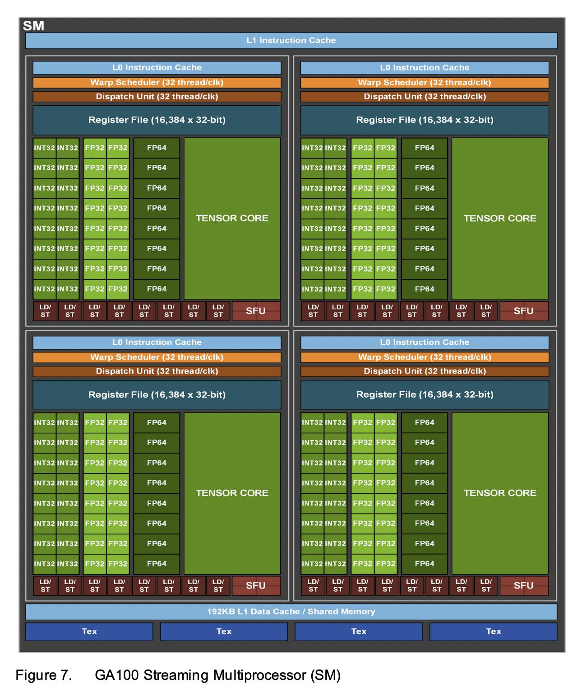
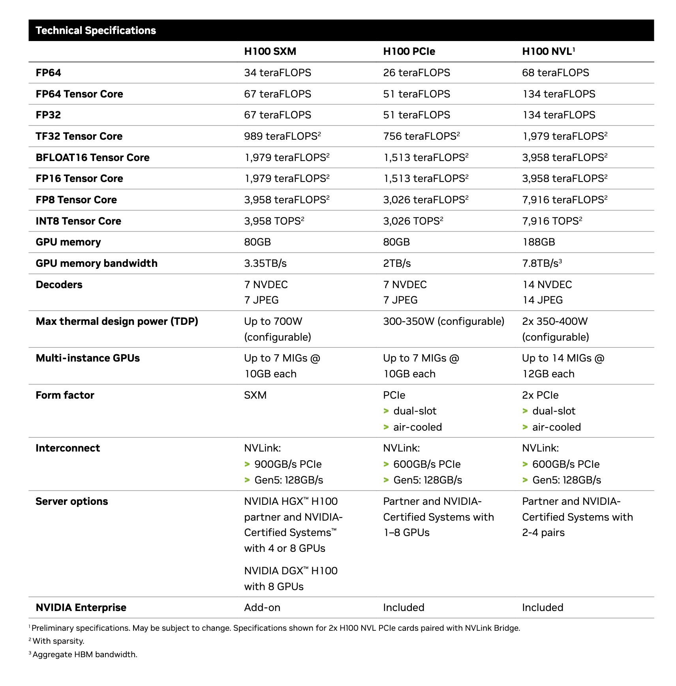

# Nvidia over the years

[GTX 200 Architecture](https://www.nvidia.com/docs/io/55506/geforce_gtx_200_gpu_technical_brief.pdf)

The OG Tesla Architecture for GPGPU/ HPC:  
<https://www.cs.cmu.edu/afs/cs/academic/class/15869-f11/www/readings/lindholm08_tesla.pdf>

 > 
 > Nvidia retired the Tesla brand in May 2020, reportedly because of potential confusion with the brand of cars.\[1\] Its new GPUs are branded Nvidia Data Center GPUs\[2\] as in the Ampere-based A100 GPU.\[3\]

Nvidia FERMI  
[Nvidia "Fermi" External Contract Writeup](https://www.nvidia.com/content/pdf/fermi_white_papers/p.glaskowsky_nvidia%27s_fermi-the_first_complete_gpu_architecture.pdf)  
[Fermi Whitepaper](https://www.nvidia.com/content/pdf/fermi_white_papers/nvidia_fermi_compute_architecture_whitepaper.pdf)  
NVIDIA Fermi contains

1. **16 SMs**
1. 32 cores per SM, total **512 cores**
1. Each core contains a FP unti and INT unit  
   **Interesting thing about Fermi:** Each ==FP32 unit is capabable of also performing double precision operations in 2 clock cycles==. This capability is not observed in later architectures, which always have dedicated FP64 units in them  
   

Kepler Architecture - HPC and Consumer  
<https://en.wikipedia.org/wiki/Kepler_(microarchitecture)>  
<https://www.nvidia.com/content/dam/en-zz/Solutions/Data-Center/tesla-product-literature/NVIDIA-Kepler-GK110-GK210-Architecture-Whitepaper.pdf>  
==Had 192 FP32 and 64 FP64 units per SM==

Maxwell Architecture - HPC and Consumer  
<https://en.wikipedia.org/wiki/Maxwell_(microarchitecture)>  
==Had 128 FP32 and 4 FP64 units per SM==

NVIDIA Pascal GPUs - HPC and Consumer - powering Tesla P100 and GTX 1080  
<https://en.wikipedia.org/wiki/Pascal_(microarchitecture)>  
Comparision: <https://developer.nvidia.com/blog/inside-pascal/>  
<https://www.es.ele.tue.nl/~heco/courses/ECA/GPU-papers/GeForce_GTX_1080_Whitepaper_FINAL.pdf>

[Volta](https://en.wikipedia.org/wiki/Volta_(microarchitecture)) - HPC - Tesla V100 - first gen tensor cores - [architecture pdf](https://images.nvidia.com/content/volta-architecture/pdf/volta-architecture-whitepaper.pdf)  
Compute Capability 7.0 (64 FP32, 64 INT32, 32 FP64 units) [link](https://docs.nvidia.com/cuda/cuda-c-programming-guide/index.html#compute-capability-7-x)  
[Turing](https://en.wikipedia.org/wiki/Turing_(microarchitecture)) - Consumer - RTX 20 series - 2nd gen tensor cores , 1st gen Ray tracing cores - [architecture pdf](https://www.techpowerup.com/gpu-specs/docs/nvidia-turing-architecture.pdf) -  
Compute Capability 7.5 (note there are only 2 FP64 cores)

RTX 30 series GPUs, powered by [Ampere GA10x](https://www.nvidia.com/content/PDF/nvidia-ampere-ga-102-gpu-architecture-whitepaper-v2.1.pdf) architecture (slightly different than GA100 used for A100)  
Each SM in GA10x GPUs contain:

1. **128 FP32 CUDA Cores**
1. **2 FP64 CUDA Cores**
1. **64 INT32 CUDA Cores**
1. 4 third-generation **Tensor Cores**,
1. Four **Texture Units**,
1. one second-generation **Ray Tracing Core**, and 128 KB of L1/Shared Memory  
   All RTX 30 series GPUs have CUDA Compute Capability 8.6 [link](https://docs.nvidia.com/cuda/cuda-c-programming-guide/index.html#compute-capability-8-x)

==Number of SMs vary== in each GPU implementation of GA10x architecture  
RTX 3060Ti has 38 SMs  
RTX 3090 has 82 SMs  
RTX 3090Ti has 84 SMs

**About FP64 Support:** The GA102 GPU (RTX 3090Ti) features 168 FP64 units (two per SM), which are not depicted in this diagram. The FP64 TFLOP rate is 1/64th the TFLOP rate of FP32 operations. The small number of FP64 hardware units are included to ensure any programs with FP64 code operate correctly, including FP64 Tensor Core code

[Nvidia A100](https://images.nvidia.com/aem-dam/en-zz/Solutions/data-center/nvidia-ampere-architecture-whitepaper.pdf) GPU powered by NVIDIA Ampere GA100 Architecture  
Each SM in GA100 architecture contains:

* **64 FP32 and INT32** CUDA Cores
* **32 FP64** CUDA Cores,
* 4 Third-generation **Tensor Cores**  
  Nvidia A100 support CUDA Compute Capability 8.0 [link](https://docs.nvidia.com/cuda/cuda-c-programming-guide/index.html#compute-capability-8-x)

Number of SM may vary per implementation  
The NVIDIA A100 Tensor Core GPU implementation of the GA100 GPU includes:

* 7 GPCs, 7 or 8 TPCs per GPC, 2 SMs per TPC, up to 16 SMs/GPC, **108 SMs**
* 5 HBM2 stacks, 10 512-bit Memory Controllers

SM in NVIDIA GA100 Ampere Architecture (used in A100 series)  

Hopper Microarchitecture - HPC - H100  
<https://en.wikipedia.org/wiki/Hopper_(microarchitecture)>

Whitepaper: <https://resources.nvidia.com/en-us-tensor-core/gtc22-whitepaper-hopper>

Datasheet:  

NVIDIA H100 GPU contains total 132 SMs per GPU  
Each SM has (compute capability 9.0 for H100)

* 128 FP32 cores for single-precision arithmetic operations,
* 64 FP64 cores for double-precision arithmetic operations,
* 64 INT32 cores for integer math,
* 4 mixed-precision fourth-generation Tensor Cores supporting the new `FP8` input type in either `E4M3` or `E5M2` for exponent (E) and mantissa (M), half-precision (fp16), `__nv_bfloat16`, `tf32`, INT8 and double precision (fp64) matrix arithmetic (see [Warp Matrix Functions](https://docs.nvidia.com/cuda/cuda-c-programming-guide/index.html#wmma) for details) with sparsity support,
* 16 special function units for single-precision floating-point transcendental functions
* 4 texture units
* 4 warp schedulers

Ada Lovelace - Consumer - RTX 40 series  
<https://en.wikipedia.org/wiki/Ada_Lovelace_(microarchitecture)>  
Whitepaper: <https://images.nvidia.com/aem-dam/Solutions/Data-Center/l4/nvidia-ada-gpu-architecture-whitepaper-v2.1.pdf>

RTX 4090 GPU (AD102 architecture) contains total 144 SMs  
Each SM contains (compute capability 8.9 for RTX 4090)

1. 128 FP32 CUDA Cores
1. 2 FP64 CUDA Cores
1. 64 INT32 CUDA Cores
1. 16 special function units
1. 4 fourth-generation **Tensor Cores**
1. 4 texture units
1. one third-generation **Ray Tracing Core**
1. 4 warp schedulers.

## References

1. Cuda Architecture capability:  
   Gives info on number of functional units per SM  
   <https://docs.nvidia.com/cuda/cuda-c-programming-guide/index.html#architecture-8-x>  
   GPUs with their Cuda compatibility:  
   <https://developer.nvidia.com/cuda-gpus>
1. All HPC/GPGPU offerings: <https://en.wikipedia.org/wiki/Nvidia_Tesla>
