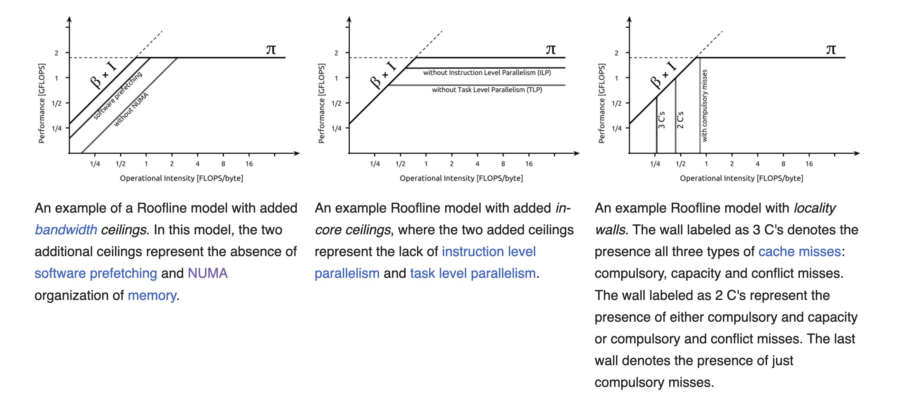

# Roofline model

<https://en.wikipedia.org/wiki/Roofline_model>

For determining memory bound vs compute bound tasks

## Arithmetic Intensity

The *arithmetic intensity* $I$ also referred to as *operational intensity* is the ratio of the work $W$ (usuallly in $FLOPs$ or Floating Point Operations) to the memory traffic $Q$ ($bytes$)

$$I = \frac{W}{Q}$$

It denotes the number of operations per byte of memory traffic. $(FLOPSs / byte)$

## Rereferences

1. "Computer Architecture: A Quantitative Approach" Book, chapter 4 : SIMD and GPU programming
