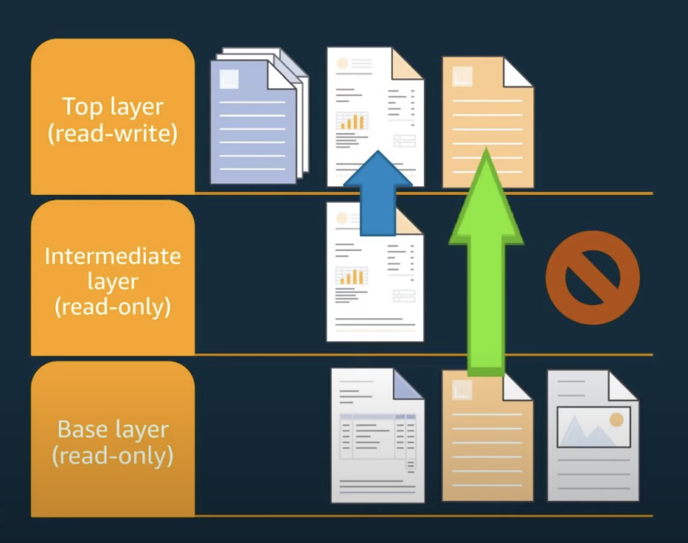

# Linux mechanisms used in containers

## Cgroups

[man page](https://man7.org/linux/man-pages/man7/cgroups.7.html)

Control how much resource you can use

cgroups are controlled using a virtual file system located at `/sys/fs/cgroup`

In linux, there are 2 versions of cgroups, v1 and v2 (latest),  
The difference is important to understand, please refer [here](https://docs.kernel.org/admin-guide/cgroup-v2.html#deprecated-v1-core-features)

In each [cgroup v1](https://www.kernel.org/doc/html/v5.9/admin-guide/cgroup-v1/cgroups.html#how-are-cgroups-implemented):  
Each cgroup is represented by a directory in the cgroup file system containing the following **files** describing that cgroup:

 > 
 > * tasks: list of tasks (by PID) attached to that cgroup. This list is not guaranteed to be sorted. Writing a thread ID into this file moves the thread into this cgroup.
 > * cgroup.procs: list of thread group IDs (TGIDs) in the cgroup. This list is not guaranteed to be sorted or free of duplicate TGIDs, and userspace should sort/uniquify the list if this property is required.  
 >   Writing either:  
 >   a thread group ID  
 >   PID of any task in a threadgroup  
 >   into this file moves all threads in that group into this cgroup.
 > * notify_on_release flag: run the release agent on exit?
 > * release_agent: the path to use for release notifications (this file exists in the top cgroup only)

In **cgroup v2** , `tasks` file is removed, and `cgroup.procs` is to be used for adding PIDs

According to man [cgroup v2](https://www.kernel.org/doc/html/v5.9/admin-guide/cgroup-v2.html#organizing-processes-and-threads),

 > 
 > each cgroup has a read-writable interface file “cgroup.procs”. When read, it lists the PIDs of all processes which belong to the cgroup one-per-line. The PIDs are not ordered and the same PID may show up more than once if the process got moved to another cgroup and then back or the PID got recycled while reading.  
 > A process can be migrated into a cgroup by writing its PID to the target cgroup’s “cgroup.procs” file. Only one process can be migrated on a single write(2) call. If a process is composed of multiple threads, writing the PID of any thread migrates all threads of the process.

For a given thread(process) with PID (TID) = pid , the cgroup information will be present at `/proc/<pid>/cgroup`  
If cgroup v1 is in use in the system, this file may contain multiple lines, one for each hierarchy.  
The entry for cgroup v2 is always in the format “0::$PATH”:

Enabling and Disabling  
Each cgroup has a “cgroup.controllers” file which lists all controllers available for the cgroup to enable:

````bash
# cat cgroup.controllers
cpu io memory
````

**No controller is enabled by default.** Controllers can be enabled and disabled by writing to the “cgroup.subtree_control” file:

````bash
# echo "+cpu +memory -io" > cgroup.subtree_control
````

Only controllers which are listed in “cgroup.controllers” can be enabled.

Important Constraints in cgroup v2:

Top-down Constraint  
Resources are distributed top-down and a cgroup can further distribute a resource only if the resource has been distributed to it from the parent. This means that all non-root “cgroup.subtree_control” files can only contain controllers which are enabled in the parent’s “cgroup.subtree_control” file. A controller can be enabled only if the parent has the controller enabled and a controller can’t be disabled if one or more children have it enabled.

No Internal Process Constraint  
Non-root cgroups can distribute domain resources to their children only when they don’t have any processes of their own. In other words, only domain cgroups which don’t contain any processes can have domain controllers enabled in their “cgroup.subtree_control” files.  
This guarantees that, when a domain controller is looking at the part of the hierarchy which has it enabled, processes are always only on the leaves. This rules out situations where child cgroups compete against internal processes of the parent.  
Note that the restriction doesn’t get in the way if there is no enabled controller in the cgroup’s “cgroup.subtree\_control”. This is important as otherwise it wouldn’t be possible to create children of a populated cgroup.  
A cgroup of type **threaded** is an exception to this rule i.e. it can contain PIDs/TIDs of the processes/threads it controls + it can have threaded subtrees. This is possible since **threaded** cgroup only allows **threaded** controllers to be used, and **domain** controllers are not allowed.

According to [man cgroups](https://man7.org/linux/man-pages/man7/cgroups.7.html)  
**Tasks (threads) versus processes in cgroup v1**  
In cgroups v1, a distinction is drawn between *processes* and  
*tasks*.  In this view, a process can consist of multiple tasks  
(more commonly called threads, from a user-space perspective, and  
called such in the remainder of this man page).  In cgroups v1,  
it is possible to independently manipulate the cgroup memberships  
of the threads in a process.  
The cgroups v1 ability to split threads across different cgroups  
caused problems in some cases.  For example, it made no sense for  
the *memory* controller, since all of the threads of a process  
share a single address space.  Because of these problems, the  
ability to independently manipulate the cgroup memberships of the  
threads in a process was removed in the initial cgroups v2  
implementation, and subsequently restored in a more limited form  
(see the discussion of "thread mode" below).

cgroup v2 supports thread granularity using [threaded cgroups](https://man7.org/linux/man-pages/man7/cgroups.7.html#CGROUPS_VERSION_2_THREAD_MODE)

 > 
 > By default, all threads of a process belong to the same cgroup

According to documentation on [cgroup v2](https://www.kernel.org/doc/html/v5.9/admin-guide/cgroup-v2.html#threads),

 > 
 > The (cgroup) thread mode allows threads to be spread across a subtree while still maintaining the common resource domain (parent cgroup) for them.
 > 
 > The current operation mode or type of the cgroup is shown in the `cgroup.type` file which indicates whether the cgroup is a **normal domain, a domain which is serving as the domain of a threaded subtree (threaded domain), or a threaded cgroup**

 > 
 > In a threaded cgroup, when read, “*cgroup.threads*” contains the list of the thread IDs of all threads in the cgroup. Except that the operations are per-thread instead of per-process, “*cgroup.threads*” has the same format and behaves the same way as “*cgroup.procs*”.
 > 
 > While “*cgroup.threads*” can be written to in any cgroup, as it can only move threads inside the same threaded domain, its operations are confined inside each threaded subtree.
 > 
 > The threaded domain cgroup serves as the resource domain for the whole subtree, and, while the threads can be scattered across the subtree, all the processes are considered to be in the threaded domain cgroup. “*cgroup.procs*” in a threaded domain cgroup ==contains the PIDs of all processes in the subtree== and is not readable in the subtree proper. However, “*cgroup.procs*” can be written to from anywhere in the subtree to migrate all threads of the matching process to the cgroup

**Threaded versus domain controllers**  
[Reference](https://man7.org/linux/man-pages/man7/cgroups.7.html#CGROUPS_VERSION_2_THREAD_MODE)  
With the addition of cgroup threads mode, cgroups v2 now distinguishes two types of resource controllers:

•  *Threaded* controllers: these controllers support thread-granularity for resource control and can be enabled inside threaded subtrees.  
threaded controllers: as of linux 4.19: *cpu*, *perf_event*, and *pids*.

•  *Domain* controllers: these controllers support only process-granularity for resource control.  From the perspective of a domain controller, all threads of a process are always in the same cgroup. Domain controllers can't be enabled inside a threaded subtree. Domain controllers are all the rest of the controllers not mentioned in Threaded controllers

### threads vs processes in linux

Another card on same : [program_processes_threads](../../ComputerArchitecture/program_processes_threads.md)

==Linux does not differentiate between a thread and a process==  
A thread is just another process, which shared some data with other threads (processes)

According to [man clone](https://man7.org/linux/man-pages/man2/clone.2.html)

 > 
 > Thread groups were a feature added in Linux 2.4 to support the POSIX threads notion of a set of threads that share a single PID.  Internally, this shared PID is the so-called thread group identifier (TGID) for the thread group. Since Linux 2.4, calls to [getpid(2)](https://man7.org/linux/man-pages/man2/getpid.2.html) return the TGID of the caller.  
 > The threads within a group can be distinguished by their (system-wide) unique thread IDs (TID).  A new thread's TID is available as the function result returned to the caller, and a thread can obtain its own TID using [gettid(2)](https://man7.org/linux/man-pages/man2/gettid.2.html).

So what *you* (as a user) calls a PID (process ID) is not what the kernel calls a PID

|User view|Kernel view|
|---------|-----------|
|PID|TGID|
|TID|PID|

Following paragraph is referenced from [here](https://stackoverflow.com/a/9306150)

In the *kernel,* each thread has its own ID, called a PID, although it would possibly make more sense to call this a TID, or thread ID  
Each thread also have a TGID (thread group ID) which is the PID of the first thread that was created when the process was created.

When a new *process* is created, it appears as a thread where both the PID and TGID are the same (currently unused) number.

When a thread starts another *thread,* that new thread gets its own PID (so the scheduler can schedule it independently) but it inherits the TGID from the original thread.

That way, the kernel can happily schedule threads independent of what process they belong to, while processes (thread group IDs) are reported to you.

The following hierarchy of threads may help(a):

````
                         USER VIEW
                         vvvv vvvv
              |          
<-- PID 43 -->|<----------------- PID 42 ----------------->
              |                           |
              |      +---------+          |
              |      | process |          |
              |     _| pid=42  |_         |
         __(fork) _/ | tgid=42 | \_ (new thread) _
        /     |      +---------+          |       \
+---------+   |                           |    +---------+
| process |   |                           |    | process |
| pid=43  |   |                           |    | pid=44  |
| tgid=43 |   |                           |    | tgid=42 |
+---------+   |                           |    +---------+
              |                           |
<-- PID 43 -->|<--------- PID 42 -------->|<--- PID 44 --->
              |                           |
                        ^^^^^^ ^^^^
                        KERNEL VIEW
````

[man proc](https://man7.org/linux/man-pages/man5/procfs.5.html)

In linux, `/proc` virtual filesystem contains information about each process (thread). Information about process with (kernel) PID = pid will be present in `/proc/<pid>`

If process `pid` contains threads, information about those threads will be present in `/proc/<pid>/task/<tid>/`, tid is thread ID (kenel PID of thread). Here PID of parent will also act as TGID

Since every thread is another process according to linux kernel, each thread will also have a `/proc/tid` directory, which has same content as corresponding `/proc/<pid>/task/<tid>` directory.

The `/proc/tid` subdirectories are *not* visible when iterating through `/proc` with [getdents(2)](https://man7.org/linux/man-pages/man2/getdents.2.html) (and thus are *not* visible when one uses [ls(1)](https://man7.org/linux/man-pages/man1/ls.1.html) to view the contents of `/proc`).  
However, the pathnames of these directories are visible to (i.e., usable as arguments in) system calls that operate on pathnames

#### Behavior in htop and ps

[reference](https://www.baeldung.com/linux/htop-ps-more-processes#why-the-number-of-processes-is-different)

both *htop* and *ps* read the details about the number of the running processes and threads from the [*/proc*](https://man7.org/linux/man-pages/man5/proc.5.html) filesystem. More specifically, the `/proc/<pid>` directory and the subdirectories `/proc/<pid>/task/<tid>` found underneath.

unlike *ps*, the ==htop command displays the running processes and their corresponding individual threads by default==.  
Moreover, `htop` only shows user level threads, not kernel threads.  
We can change above behaviors in the settings of htop.

In `ps`, to select all the processes and show the threads, we can pass the `-eLf` flag

### zombie processes

<https://www.baeldung.com/linux/clean-zombie-process>

## Namespaces

<https://man7.org/linux/man-pages/man7/user_namespaces.7.html>

Control what you can see

Unlike cgroups, namespaces are **not controlled by virtual filesystem manipulation**, instead they have to be specified by system calls like **clone(2)** and **unshare(2)**. Details on these functions are [below](#relevant-commands)

To look at all the namespaces current process is part of, run

````bash
readline /proc/$$/ns/*
````

This will show the name of the ns and the inode of the fd specifying that namespace

### Persistent namespaces

**Unlike cgroups, namespaces can not be empty**  
kernel automatically garbage-collects namespaces if no process is part of it  
To persist a namespace as long as we want, we can bind mount it to a process's ns  
e.g.

````
mount --bind /proc/$$/ns/net /var/run/netns/custom
````

Here we mount the network namespace of current process to the directory  `/var/run/netns/custom`. Since `/var` is persistent file system, the network namespacae is also persisted.

### How a process can enter a namesapce?

Using syscalls (i.e. inside a C program):

1. Run `open(2)`  to open a file from `/proc/<pid>/ns` . You can open a bind mount `/var/run/ns` as shown above in persistent namespaces.
1. Pass the file descriptor to `setns(2)` to enter mentioned namespace.

In a linux terminal,  
`nsenter(1)` command can be used to do this interactively  
`ip-netns(8)` works specifically for network namespaces

## Overlay Filesystem

[Documentation of overlays fs](https://docs.kernel.org/filesystems/overlayfs.html)

  
Ref: [youtube](https://youtu.be/x1npPrzyKfs?list=PLaVTMVckiaHKlRz94JVb-EsxA1JYFHdQ0&t=1238)

### Union filesystems

* Unified view of two (or more) filesystems
* Popular in container runtimes (like Docker) to implement layers
* Efficient use of storage when making minor modifications to images
* Efficient use of storage when starting multiple containers with identical images

### Overlay filesystem

* A Union Filesystem where directories/files are stacked on top of one another

* Uses file name to describe the files

* For files, the upperdir hides corresponding file in lowerdir.
* For directories, the contents of upperdir and lowerdir **are merged**.  Therefore, files present in lowerdir which are not present in upperdir are also visible.
* When writing to the overlay
  * lowerdir is not modified, all updates/addition go to upperdir
  * Existing files are copied-up to the upperdir for modificiation
  * Whole file is copied, not just blocks
* "Deleting" a file in the upperdir creates a whiteout
  * Files: character devices with 0/0 device number
  * Directories: xattr "trusted. overlay. opaque" set to "y"
* An upperdir can have multiple lowerdirs
* Overlay filesystems can be created with `mount (2)`
* You can examine the mounts with
  * `mount (8)`
  * `/proc/mounts`
  * `/proc/$$/mountinfo`

 > 
 > In docker, the (default) overlay filesystem is present at `/var/lib/docker/overlay2`

## Relevant commands

### unshare(1)

Linux user (shell) commands to **run program in new namespaces**  
We need to specify which namespace to create by passing options  
Check man page for more info  
`podman unshare` is basically `unshare --user` with some additional things

### unshare(2)

Standard C "system calls" library  
allows a running process (or thread) to ==disassociate parts of its execution context== that are currently being shared with other processes (or threads), ==and create new namespaces==

We can use `CLONE_NEW` family of flags to specify which namesapces to disassociate/create

````
int unshare(int** _flags_**);
````

[unshare(1)](#unshare(1)) command and [podman unshare](#podman-unshare) work on this syscall  
Also used in containers

### fork(2)

Standard C "system call" library  
==creates a new process by duplicating the calling process==

````
 pid_t fork(void);
````

### clone(2)

Standard C "system call" library  
system calls ==create a new ("child") process==, in a manner similar to [fork(2)](#fork(2)).

By contrast with [fork(2)](#fork(2)), these system calls provide more precise control over what pieces of execution context are shared between the calling process and the child process

clone also ==create new namespaces== for new processes  
We can use `CLONE_NEW` family of flags to specify which namesapces to create

### exec(1p)

POSIX (shell) command to

1. **execute commands**  
   If exec is specified with command, it shall ==replace the current shell with command== without creating a new process
1. **open, close, and/or copy file** descriptors as specified by any redirections as part of the command

### execve(2)

==executes given program replacing the calling process==  
Present in standard C "system calls" library

````
int execve(const char *pathname, char *const _Nullable argv[],
                  char *const _Nullable envp[]);
````

## References

[Linux container primitives - LFNW](https://youtu.be/x1npPrzyKfs?list=PLaVTMVckiaHKlRz94JVb-EsxA1JYFHdQ0)

[Containers from scratch - Liz Rice](https://youtu.be/8fi7uSYlOdc)  
Repo containing GO file: <https://github.com/lizrice/containers-from-scratch/blob/master/main.go>
