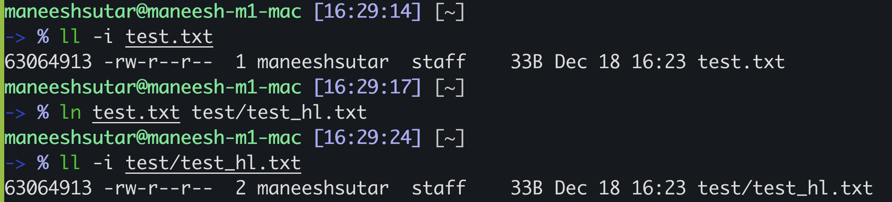
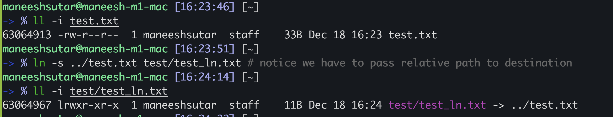

# Links in Linux

[ln(1)](https://man7.org/linux/man-pages/man1/ln.1.html) command can be used to create links between files

## Hard links

[ln(2) syscall](https://man7.org/linux/man-pages/man2/link.2.html) in linux is used to make hard links to a file

Syntax: `ln <source> <destination>`  
By default `ln(1)` creates hard links

  
In above image,

1. Destination is a file, which points to the same [inode](inode.md) of the source.
1. Destination has file type 010 i.e. regular file
1. Since ==destination also points to same inode==, it does not consume any extra space (apart from the destination file's entry in its parent directory's table )

**Source MUST be a valid path** since `ln` command needs to resolve the source path and get [inode](inode.md) of the source

## Soft / Symbolic links

[symlink(2) syscall](https://man7.org/linux/man-pages/man2/symlink.2.html) in linux is used to make symbolic links to a file

Syntax: `ln -s <source> <destination>`

if destination is a file, then ==it only contains "source" string as its content==.  

In the above image,

1. the size of the symbolic is "11B" since it contains 11 characters path "../test.txt"
1. ==The [inode](inode.md) of the source and destination are different==
1. its file type is "symbolic link" denoted by "l". Numerically itzs file type number is 012 (in octal).

If destination is a directory, it will try to create a new symbolic link file in the destination directory with same name as the `basename <source>`.

**NOTE: "source" part in above command is literally a string, does not necessarily have to be a valid path**  
Either pass

1. Absolute path of the source file
1. ==Relative path of the source file w.r.t destination file==

If the "source" path is not valid, weird things happen, **so don't do it**  
e.g.  
`No such file or directory`  
`Too many levels of symbolic links`
