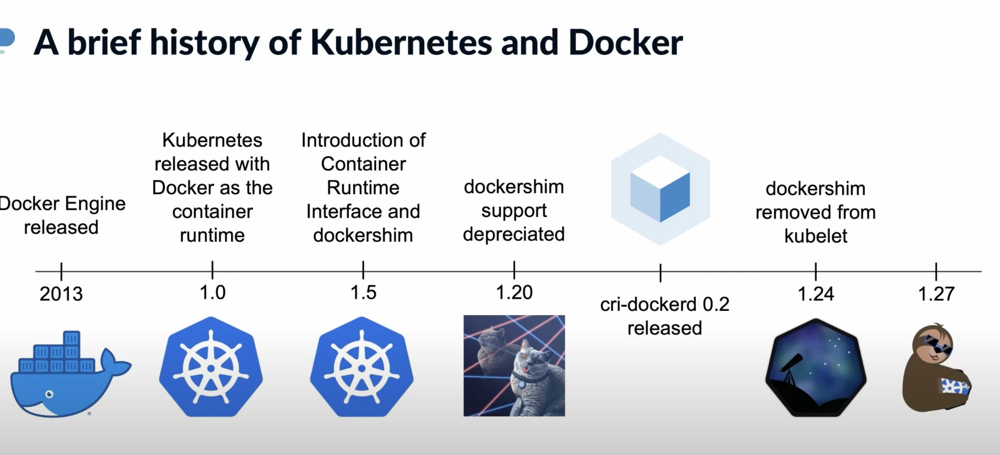
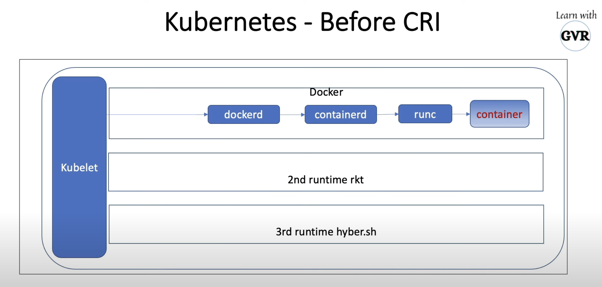
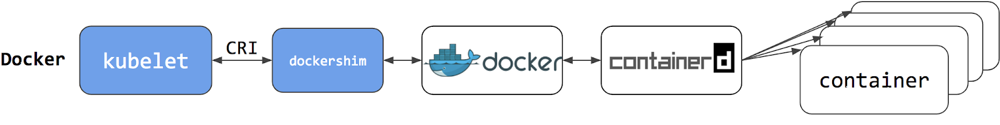

---
aliases:
- CRI
- Container Runtime Interface
author: Maneesh Sutar
created: 2024-10-02
modified: 2024-10-05
tags:
- kubernetes
- linux/container
title: Container Runtime Interface
---

# Container Runtime Interface

 > 
 > This article contains my observations from various explorations I conducted regarding Kubernetes and docker. It might be a little unstructured, so bare with me. Also see to [colima](colima.md) to read about various experiments I did with minikube.

The [Container Runtime Interface](https://github.com/kubernetes/cri-api) is a plugin **interface** which **enables the kubelet to use a wide variety of container runtimes**, without having a need to recompile the cluster components.

Kubernetes repo contains a good readme on [Why CRI?](https://github.com/kubernetes/community/blob/master/contributors/devel/sig-node/container-runtime-interface.md)

## Dockershim: the old way

  
Image [ref](https://youtu.be/2PvzB9st15Q?t=272)

[Historically](https://kubernetes.io/blog/2022/05/03/dockershim-historical-context/), the early versions of Kubernetes only worked with a specific container runtime: **Docker Engine**. Later, Kubernetes added support for working with other container runtimes.

  
Image [ref](https://youtu.be/0sca08LRigE?t=187)

==The CRI standard was== [created](https://kubernetes.io/blog/2016/12/container-runtime-interface-cri-in-kubernetes/) to ==enable interoperability between orchestrators (like Kubernetes) and many different container runtimes== (crun, rkt, hypernetes).

Docker Engine doesn't implement that interface (CRI). To solve this, a small software shim (dockershim) was introduced as part of the kubelet component specifically to fill in the gaps between Docker Engine and CRI. But ==dockershim was never intended to be a permanent solution==, and over the course of years, its existence has introduced a lot of unnecessary complexity to the kubelet itself.

  
Image [ref](https://kubernetes.io/blog/2018/05/24/kubernetes-containerd-integration-goes-ga/)

So dockershim was deprecated in k8s v1.20, and completely removed in v1.24.

As mentioned in this [article from kubernetes](https://kubernetes.io/blog/2020/12/02/dont-panic-kubernetes-and-docker/#so-why-the-confusion-and-what-is-everyone-freaking-out-about):

 > 
 > You see, the thing we call “Docker” isn’t actually one thing—it’s an entire tech stack, and one part of it is a thing called “containerd,” which is a high-level container runtime by itself  
 > Docker is cool and useful because it has a lot of UX enhancements that make it really easy for humans to interact with while we’re doing development work, but those UX enhancements aren’t necessary for Kubernetes, because it isn’t a human.
 > 
 > Docker isn’t compliant with CRI, the [Container Runtime Interface](https://kubernetes.io/blog/2016/12/container-runtime-interface-cri-in-kubernetes/). If it were, we wouldn’t need the shim, and this wouldn’t be a thing

## CRI: the replacement

Kubelet always uses CRI except for using the rktnetes integration.  
The old, pre-CRI Docker integration was removed in 1.7.

To maintain backward compatibility, Docker and Mirantis came together to develop the **cri-docker**

Widely used CRIs:

* containerd's [cri plugin](containerd.md#cri) (CNCF graduated)
* [cri-o](cri-o.md) (CNCF graduated)
* [cri-docker](docker.md#cri-docker)

Deprecated CRI:

* [rktlet](https://github.com/kubernetes-retired/rktlet) - a CRI for [rkt (EOL)](https://github.com/rkt/rkt) runtime
* [frakti](https://github.com/kubernetes/frakti) - a CRI for hypervisor (VM) based containers via [runV (EOL)](https://github.com/hyperhq/runv). Replaced by [kata-containers](https://katacontainers.io/software/) project.
* [cri-containerd](https://github.com/containerd/cri) - replaced by the cri plugin inside containerd
* [singularity-cri](https://github.com/sylabs/singularity-cri)

Running kubelet with `--container-runtime-endpoint` is now deprecated, instead one must use kubelet's `--config` option specifying the config file.

**References:**  
The first release article (2016, k8s 1.5): <https://kubernetes.io/blog/2016/12/container-runtime-interface-cri-in-kubernetes/>  
Not so updated readme file in k8s: <https://github.com/kubernetes/community/blob/master/contributors/devel/sig-node/container-runtime-interface.md>

## cri-tools

[cri-tools](https://github.com/kubernetes-sigs/cri-tools) provide CLI and validation tools for Kubelet Container Runtime Interface (CRI) .

`crictl` is a command-line interface for CRI-compatible container runtimes.  
Supported comamands: `images, ps`  
See the [documentation](https://github.com/kubernetes-sigs/cri-tools/blob/master/docs/crictl.md)
