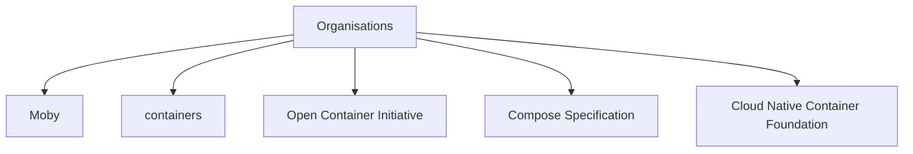

# Organisations

## CNCF

Refer: <https://www.cncf.io/>

Cloud Native Container Foundation

[containerd](containerd.md) and [distribution](https://github.com/distribution/distribution) are donated by [docker](https://www.docker.com/) to CNCF

CNCF also hosts kubernetes, and its associated projects

CRI-O also kind of comes under CNCF as one of the "graduated" projects

## OCI

Refer: <https://opencontainers.org/> and their [github-org](https://github.com/opencontainers)

Defines a standard specifications for runtimes, images, and distribution

[Docker](https://www.docker.com/) donated [runc](oci_container_runtimes.md#runc) to OCI

## Compose-spec

Refer: <https://compose-spec.io/> and [github](https://github.com/compose-spec)

Contains repositories with specification for "compose" files like `docker-compose.yml`

## Moby

Refer: <https://github.com/moby>

A github organisation where [Docker](https://www.docker.com/) hosts all their open-sourced repositories.

The [moby/moby](https://github.com/moby/moby) repo is the upstream of docker engine (dockerd)

The components and tools in the Moby Project are initially the open source components that Docker and the community have built for the Docker Project.
e.g. libnetwork, hyperkit, swarmkit

## Containers

Refer: <https://github.com/containers>

I think this was initiated by redhat. Provides complete alternative to docker ecosystem.

Manages podman, container runtimes [crun](oci_container_runtimes.md#crun) and "youki", and other libraries like image, storage, buildah, skopeo.
