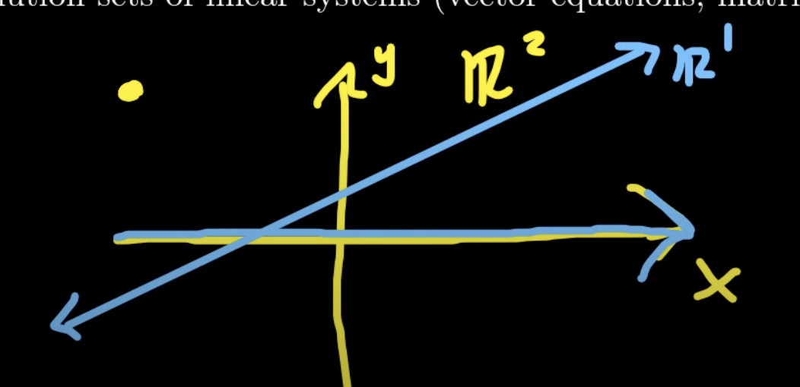

---
aliases:
- Affine Geometry
author: Maneesh Sutar
date: 2023-12-15
tags:
- maths
- public
title: Affine Set
---

# Affine Set

<https://www.youtube.com/playlist?list=PLz7t89zv8Lp2zZccWisU4ZDfs2eXtSN71>

Let $F^n$ be the vector space. The a **flat (affine set)** is a subset of $F^n$ which is [congruent](../Dictionary/Congruent-(en-US).md) to $F^m$ for some 0 \<= m \<= n.

In following example, the vector space is $\mathbb{R}2$ i.e. ==the set of all 2 dimensional vectors==. so n = 2  
The blue line, is $\mathbb{R}1$ i.e. ==set of all real numbers== (the line represents a real number line)  
The blue line is [congruent](../Dictionary/Congruent-(en-US).md) to the X axis (or Y axis too). So the **blue line is a valid affine set.**

This can be extended to 3D vector spaces also.

