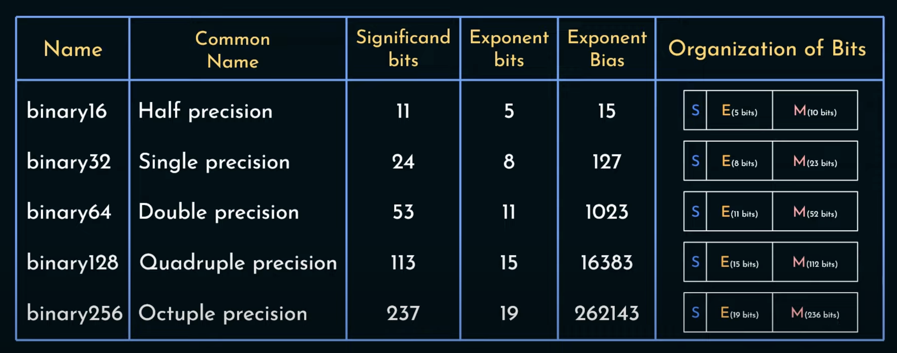
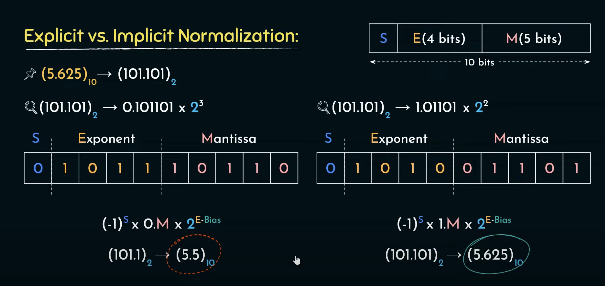
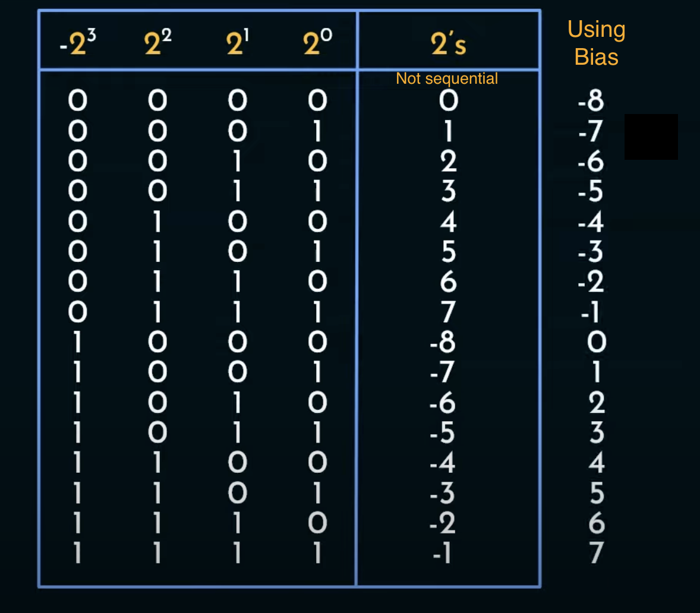
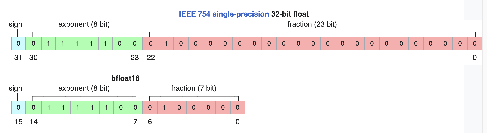

# Floating Point Numbers

In general, the value of a floating point represented number can be calculated as

$$(-1)^S * 1.M * 2^{(E-Bias)}$$

The **sign (S)** is stored in MSB.  
The **real exponent** can be computed from **exponent bits (E)**  **by subtracting Exponent Bias** (refer [Biasing](#biasing))  
The **mantissa (M)** (also known as significand or fraction)  
It uses [Implicit Normalisation](#implicit-normalisation), thus actual value is **1**.M  
First bit in mantissa has weight 1/2, then 1/4, 1/8 and so on.  
Mantissa has a (real) value between 1.0 and 2.

## Normalisation

### Need

A number in binary can be represented in thousands of ways in a mantissa-exponent format  
e.g. 101.110 can be represented as $1.0111 * 2^{2}$, $1011.1 * 2^{-1}$, $10111 * 2^{-2}$ and so on  
We need a fixed representation for a number

### Explicit Normalisation

Move the radix point to the ==left hand side of most significant "1" in the bit sequence==  
e.g. 101.110 ->   $0.10111 * 2^{3}$

### Implicit Normalisation

Move the radix point to the ==right hand side of most significant "1" in the bit sequence==  
e.g. 101.110 ->   $1.0111 * 2^{2}$  
Since we know that the bit on the LHS of radix point is always going to be 1, ==we can ignore the bit== while storing the mantissa. This **increases the precision of mantissa**

## Biasing

### Why not 2's complement to store signed exponents?

1. In 2's complement, the transition from +ve numbers to -ve **numbers is not sequential**. Also, the -ve numbers decrease as we increase the magnitude.
1. Comparators are not efficient at **comparing signed and unsigned integers**.

## Other Formats

### BF16 (brain floating point)

<https://en.wikipedia.org/wiki/Bfloat16_floating-point_format>  
This is ==different than binary16 or FP16==, commonly known as half-precision  
In **FP16**, there are 5 bit exponent and 10 bit mantissa,  
BF16 has ==8 bit exponent and 7 bit mantissa==

#### Why 8 bits?

Comparing with FP32 or binary32, it is ==trucated in the mantissa==, but keeps the same exponents.  
**This makes it easy to convert to and from binary32 format**  
This removes the precision from mantissa at the gain of widening the range of possible numbers (compared to binary16)

#### Application of BF16

 1. [accelerating](https://en.wikipedia.org/wiki/Hardware_acceleration "Hardware acceleration") [machine learning](https://en.wikipedia.org/wiki/Machine_learning "Machine learning")  
 2. [near-sensor computing](https://en.wikipedia.org/wiki/Intelligent_sensor "Intelligent sensor")

## Quantization

[quantization on hugging face](https://huggingface.co/docs/optimum/concept_guides/quantization#quantization)  
Quantization is a technique to reduce the computational and memory costs of running inference by ==representing the weights and activations with low-precision data types like 8-bit integer== (`int8`) instead of the usual 32-bit floating point (`float32`).

$$x_q = round(x/S + Z)$$

where $x$ = floating point number with any precision (`float32`, `float64`)  
S = **scale**, and is a positive number with ==same precision as $x$==  
Z = the **zero-point**, it is the `int8` value corresponding to the value `0` in the `float32` or `float64` realm.

The scale (S) will vary per application basis, and needs to be decided such that $x_q$ will be able to represent all the necessary floating point numbers in our application without losing a lot on precision.

### INT16

A quantized data format to store floating point numbers  
Contains **1 sign bit and a 15 bit mantissa**

### INT8

A quantized data format to store floating point numbers  
Contains **1 sign bit and a 7 bit mantissa**

### Application of quantization

* storing models of neural network

## Additional Notes

What Every Computer Scientist Should Know About Floating-Point Arithmetic  
[https://dl.acm.org/doi/pdf/10.1145/103162.103163](https://dl.acm.org/doi/pdf/10.1145/103162.103163)

William Kahan  
"How Futile are Mindless Assessments of Roundoff in Floating-Point Computation ?"  
<https://people.eecs.berkeley.edu/~wkahan/Mindless.pdf>

<https://arxiv.org/pdf/2305.14314.pdf>  
QLORA introduces multiple innovations designed to reduce memory use without sacrificing performance:  
(1) **4-bit NormalFloat** (4NF)  
(2) **Double Quantization**, a method that quantizes the quantization constants,

[https://github.com/TimDettmers/bitsandbytes](https://github.com/TimDettmers/bitsandbytes)  
The bitsandbytes is a lightweight wrapper around CUDA custom functions, in particular 8-bit optimizers, matrix multiplication (LLM.int8()), and quantization functions

[herbie](herbie.md)  simplifies floating point calculations to increase accuracy
