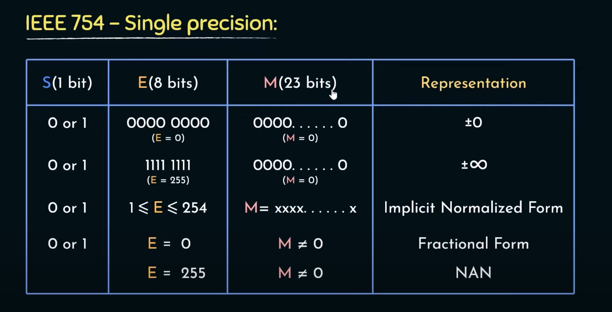
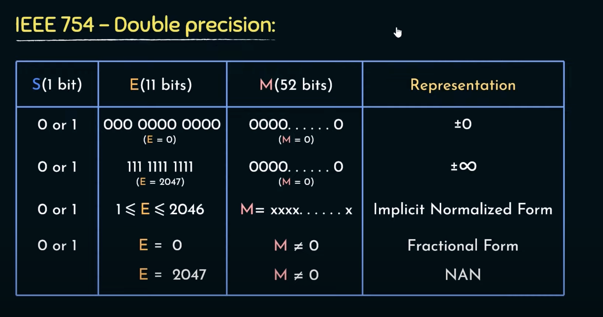

---
aliases:
- IEEE754
author: Maneesh Sutar
created: 2023-08-17
modified: 2025-04-14
tags: []
title: The IEEE754 Floating Point Format
---

# The IEEE754 Floating Point Format

[Online converter](https://www.h-schmidt.net/FloatConverter/IEEE754.html)  
IEEE754 creates a standard for the floating point numbers, and also defines how non-number values (NaN, infinity) can be presented  
Just like [Floating Point Numbers](floating_point_numbers.md), the value of IEEE754 can be given as

$$(-1)^S * 1.M * 2^{(E-Bias)}$$

# NaN in IEEE754

<https://en.wikipedia.org/wiki/NaN#>

**All 11 bits of exponent should be high**, **plus at least one mantissa**  
This allows for pogrammers to specify multiple types of NaNs, by combination of the sign bit and 23 bits of mantisa

## Quite vs Signaling NaN

Signalling NaNs, or **SNaNs**, **trigger an exception when encountered**, while quite NaNs, or **QNaNs**, are simply **propagated through computation until they appear in human-consumable final results**.

### How IEEE 754 distinguishes these?

**The most significant bit of the mantissa** field distinguishes between the two kinds of NaNs: it is cleared (0) for SNaNs and set (1) for QNaNs.

## Is NaN == Infinity?

In floating-point calculations, NaN is not the same as [infinity](https://en.wikipedia.org/wiki/Extended_real_number_line "Extended real number line"), although both are typically handled as special cases in floating-point representations of real numbers as well as in floating-point operations.

## Is it wasing a lot of space for NaNs?

<https://stackoverflow.com/questions/40785756/is-ieee-754-floating-point-representation-wasting-memory>

**Advantage of such representation is :**

* All the special input operands can be detected by examining the exponent field only, which is either all-`0` (zeros and denormals), or all-`1` (infinities and NaNs)
