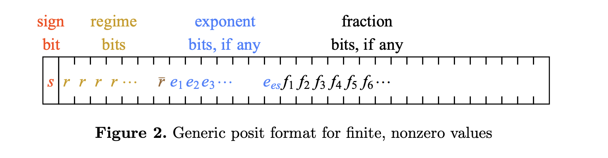
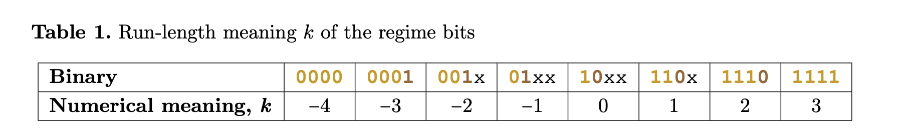
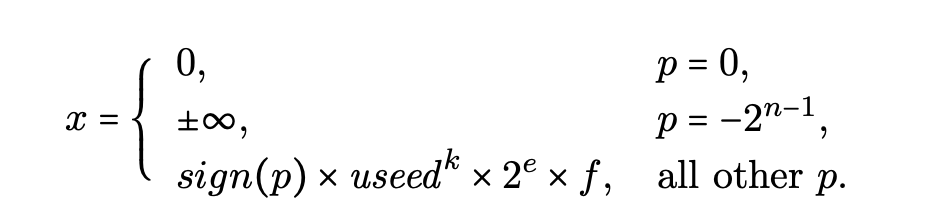
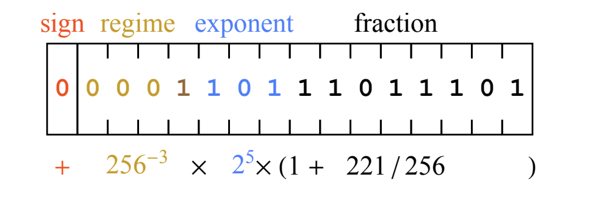

# Posit number format

Research article: [Beating Floating Point at its Own Game: Posit Arithmetic](https://www.researchgate.net/publication/322151112_Beating_Floating_Point_at_its_Own_Game_Posit_Arithmetic)  
Most of the images below are taken from above article

Also see the [float-posit converters](https://github.com/maneesh29s/just-cpp-things/tree/main/gists/posit-converters) I made using the [universal](https://github.com/stillwater-sc/universal) c++ library.

**An n-bit posit number contains:**

1. 1 compulsory sign bit
1. 1 or more regime bits
1. 0 or more exponent bits, ==length (es) is pre-determined by the standard==
1. 0 or more fraction bits  
   So it possible that the posit number ==only contains 1 sign and rest regime bits==

## Sign bit

0 : positive number  
1 : negative number

Unlike [IEEE754](ieee754_floats.md), ==negative numbers in posit are in *2's complement* form==  
So to get equivalent decimal value, first convert all n bits to 2's complement form.

Because it does not use signed magnitude form, there's ==no negative zero==,  
also both ==+inf and - inf are represented by same bit pattern==

## Regime bits

Run of 1s (positives) or 0s (negatives) terminated by a bit of opposite length  
  
The numerical value of regime bits "k" determines ==the power of useed==  
Where **useed =** $2^{(2^{es})}$

It is possible that whole posit number contains ==only regime bits with 1 sign bit==  
e.g. if n = 4, 0111 contains 3 regime bits, whose k = 2  
while 0110 also contains 3 regime bits, last 0 is terminator, thus k = 1  
Fractions will be present only if regime bits are terminated at least within n-1 bits  
Exponent length is pre-determined at least in standard posit formats.

## Exponent bits

These are optional  
**es = number of exponent bits**  
Standard posit formats (posit8, posit16, posit32 etc) have ==pre-defined number of exponent bits (es)==

Unlike [IEEE754](ieee754_floats.md) the numerical value of exponent bits ***e*** is **unsigned integer**. So no negative exponent.  
Similar to IEEE754, the *e* determines the power of 2.

## Fraction bits

There are optional  
The numerical value of fraction is always ==preceded by 1==. There are no **denormal numbers**  
The calculation is similar to [IEEE754](ieee754_floats.md)  
Number of fraction bits is not fixed by standard.

## Overall Value

**Note**: the last statement in following diagram is ambiguous, as posit uses 2's complement format, not signed magnitude format.

Explaination from [Beating Floating Point at its Own Game: Posit Arithmetic](https://www.researchgate.net/publication/322151112_Beating_Floating_Point_at_its_Own_Game_Posit_Arithmetic)

 > 
 > The sign bit 0 means the value is positive. The regime bits 0001 have a run of three 0s, which means k is −3; hence, the scale factor contributed by the regime is 256−3. The exponent bits, 101, represent 5 as an unsigned binary integer, and contribute another scale factor of 25. Lastly, the fraction bits 11011101 represent 221 as an unsigned binary integer, so the fraction is 1 + 221/256. The expression shown underneath the bit fields in fig. 5 works out to 477/134217728 ≈ 3.55393 × 10−6.

## Differences with IEEE754

1. No NaNs
1. Fixed representation for 0, no -ve / +ve zero
1. Fixed represnetation for both +inf and -inf
1. No denormals
1. 2's complement representation of negative numbers
1. No fixed length of fraction bits or exponent bits

## Standard posit formats

* **Posit8** is 8 bits with es=0;
* **Posit16** is 16 bits with es=1;
* **Posit32** is 32 bits with es=2.
* **Posit64** is 64 bits with es=3
* **Posit128** is 128 bits with es=4

## Further Read

Details of posit (long read)  
<https://posithub.org/docs/Posits4.pdf>

## Other resources

1. **Unum**: <https://en.wikipedia.org/wiki/Unum_(number_format)#>

1. PPT Standford lecture by John (short read), not really clear what happens as no explaination: <https://web.stanford.edu/class/ee380/Abstracts/170201-slides.pdf>
