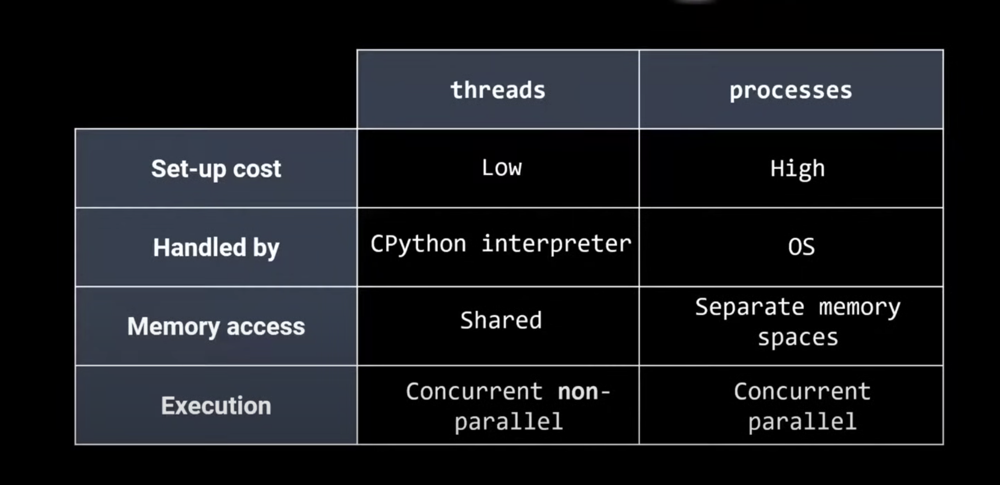
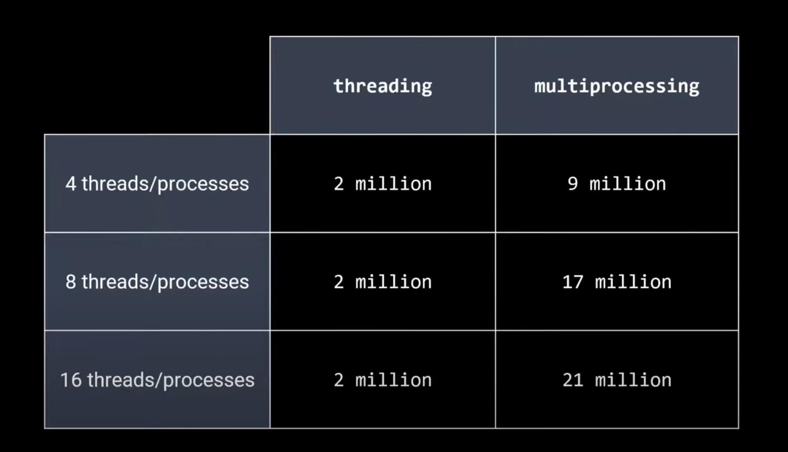

# Multithreading vs Multiprocessing in Python

Pre-requisites: [Multithreading and Multiprocessing](../ComputerArchitecture/multithreading_and_multiprocessing.md)

 > 
 > Remember the golden rule: `multithreading` for I/O bound tasks and `multiprocessing` for CPU bound task

## Python threads vs process

Following table shows python specific details of [program_processes_threads](../ComputerArchitecture/program_processes_threads.md)

## Global Interpreter lock (GIL)

1. **Ensures thread safety**

1. Improves single thread performance

1. ==Prevents simultaneous multi-threading==

1. Bad for CPU limited tasks

1. I/O limited threads are hardly affected

## Outcomes

Following benchmarks were run on a 8 core / 16 threads CPU  
We have measuring number of function calls, higher the better  
(NOTE: below **multithreading** only uses 1 process and either **4/8/16 threads**. **Multiprocessing** uses **4/8/16 processes** with 1 thread each)

## Conclusion

1. **Python is multithreaded**

* It ==is concurrent but not parallel==
* CPython will consider switching threads every 15 ms or when an I/0 operation is encountered

1. **Multi-threaded does not strictly mean single-core**

* the OS may switch the python process between physical and virtual CPU cores!

1. **multiprocessing** is the ==standard python way to increase processing power== if needed

1. Most **numerical libraries** ==(numpy, scipy, tensor flow) are simultaneously multi-threaded== behind the scenes

1. Since **threading** allows process data to be accessed, ==data may need to be protected with Lock==()

1. In multiprocessing, **Pipe() and Queue()** are used for processes to ==share data== between processes

1. **Pipe()** may be corrupted if accessed simultaneously

* It is NOT thread safe

1. **Queue()** can be accessed by multiple users

* It is thread and process safe

## References

1. [threading vs multiprocessing in python](https://youtu.be/AZnGRKFUU0c?list=PLaVTMVckiaHKlRz94JVb-EsxA1JYFHdQ0)
1. <https://towardsdatascience.com/multithreading-vs-multiprocessing-in-python-3afeb73e105f>
