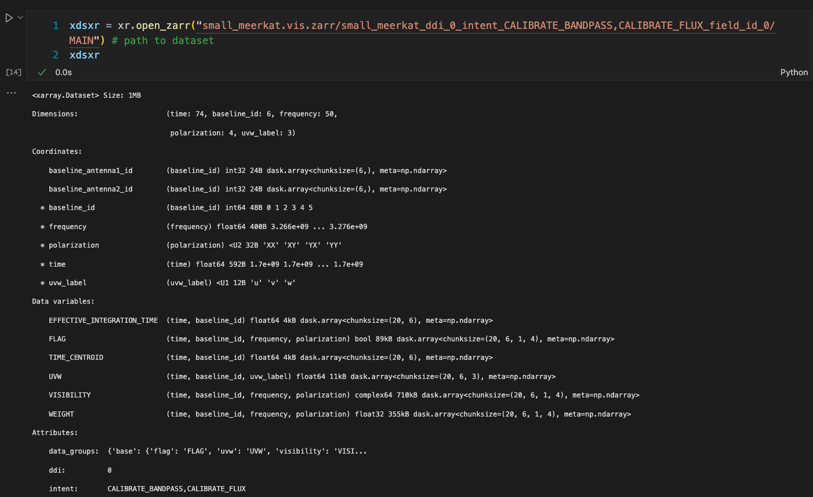
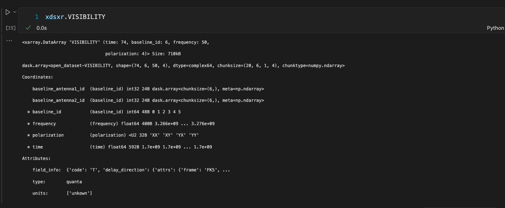

# xarray

Labelled dask arrays in memory

## Terminology

[Link](https://docs.xarray.dev/en/stable/user-guide/terminology.html#terminology)

**Must understand**  
DataArray  
DataSet  
Variable (Data variable)  
Dimension  
Coordinate  
Index

Xarray distinguishes between

* Dimension coordinate vs. Non-dimension coordinate
* Indexed coordinate vs. Non-indexed coordinate.

Dimension coordinates:

* coordinates which are also dimensions

Indexed coordinates:

* index is generated on such coordinates for fast querying
* represented with `*` when printing a `DataSet` or `DataArray`

## Xarray to Zarr

Xarray provides `to_zarr()` and `open_zarr()` methods which convert an Xarray `DataSet` to and from a zarr multidimensional grouped array.

Since Xarray supports labelled dimensions, the labels have to be stored somewhere. This is done using the zarr's attributes (`.zattrs` json file)

In each `DataArray` variable, `_ARRAY_DIMENSIONS` attribute is added with the names of the `Dimensions` (see [Terminology](#terminology))  
Also, `coordinates` attribute is stored in the `.zattrs` which represents the `Coordinates` of a `DataArray`

When reading from Zarr, Xarray automatically recognises which `DataArray`  are dimensions or coordinates or combination of both, based on the attributes of each variable.
