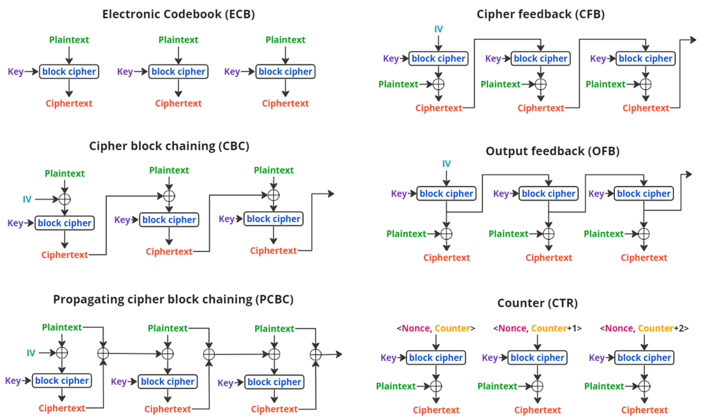
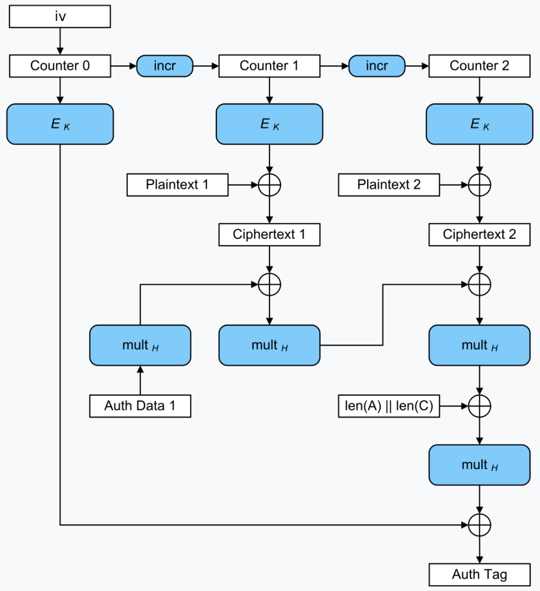

---
aliases:
- AES
- Advanced Encryption Standard
author: Maneesh Sutar
created: 2024-05-31
modified: 2025-04-14
tags: []
title: Advanced Encryption Standard (AES)
---

# Advanced Encryption Standard (AES)

AES is a symmetric key encryption algorithm, means the same key is used for both encryption and decryption.

Any public key cryptosystems like [RSA](rsa.md) or [ECDHE](elliptical_curve_crypto.md#ecdh) can be used to share the symmetric key to be used in AES.

AES uses key lengths of 128, 192, or 256 bits.  
In terms of security, even AES-128 gives better security than 2048 bit [RSA](rsa.md) encryption.

AES is significantly faster than [RSA](rsa.md) or rather any other asymmetric key algorithm, especially for large amounts of data. It is efficient for encrypting bulk data.  
Since AES is a standard, there are special CPU instructions available which perform some of the steps of AES, which makes it extremely fast (search "AES" in [intel intrinsics guide](https://www.intel.com/content/www/us/en/docs/intrinsics-guide/index.html)).

Due to its speed, AES is commonly used for encrypting data at rest (such as files on disk) and data in transit (such as data over the internet via protocols like HTTPS).

## Working

AES encryption works on blocks of data at a time.  
AES-128 will take 128 bits of data at a time and generate a 128 bit output, similrly AES 192  
and 256.

The 128 bits (16 bytes) are arranged as a matrix of 4x4 elements, each element being 1 byte.  
On the matrix, we perform a series of steps iteratively:

1. Binary XOR with partial symmetric key
1. Substitute bytes
1. Shift rows
1. Mix columns

The number of iterations vary depending on the AES key length  
AES 128: 10 iterations  
AES 192: 12 iterations  
AES 256: 14 iterations

The details of the whole algorithm are available on the [wiki](https://en.wikipedia.org/wiki/Advanced_Encryption_Standard)

## Mode of operations

[wiki](https://en.wikipedia.org/wiki/Block_cipher_mode_of_operation)  
A summaru of all modes:  

**Why CTR is preferred?**

1. Any 2 same messages will not have same cipher (unlike in basic ECB) since the cipher depends on the counter too
1. Each ciphertext can be computed parallely on a multi-core CPU, since each block is independent of the other blocks
1. Even if one of the ciphertext is changed, it will only affect the corresponding plaintext, and not the other blocks

## AES-GCM

**AES with GCM** (Galois Counter Mode) is widely used in TLS [Cypher Suites](cypher_suite.md).

GCM provides [authenticated encryption with associanted data (AEAD)](https://en.wikipedia.org/wiki/Authenticated_encryption#Authenticated_encryption_with_associated_data), thus it can be used for encryption along with message authenticaton.

It uses the CTR [mode of operation](#mode-of-operations) with a **Auth Tag** which is used to check the integrity of the entire message (all ciphertexts, length of the data, Nonce, and the received tag).

In the following diagram,  
$mult_H$ is an opration of "multiplying with $H$", where $H$ is a cipher generated when "0000...00" (size = AES bit length) is passed as input the to $E_K$ i.e. block cipher.

"**Auth Data**" is any additional data of the message, which is authenticated, but not encrypted. For example, some UUIDs or some http headers.

The "iv" is [initialisation vector](https://en.wikipedia.org/wiki/Initialization_vector) also called **Nonce**, is typically a random cypher having same or slightly less length as the AES key. The "iv" has to be shared with the receiver.

[wiki](https://en.wikipedia.org/wiki/Galois/Counter_Mode)

## References

1. <https://en.wikipedia.org/wiki/Advanced_Encryption_Standard>
1. <https://en.wikipedia.org/wiki/Block_cipher_mode_of_operation>
