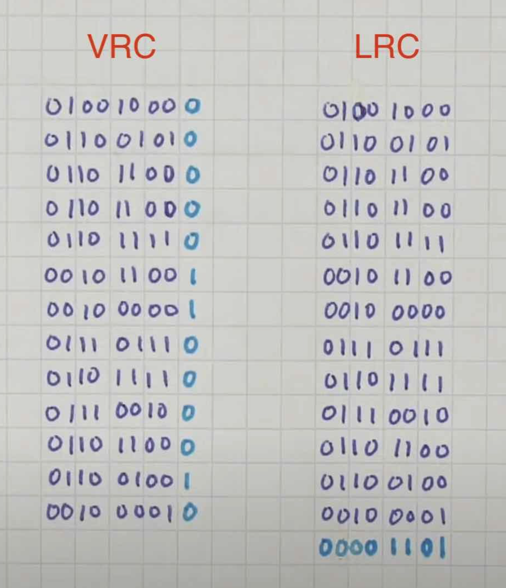

# Error Detection Schemes

Number of bit-errors which are **detectable** = MHD - 1

## Repetition

Repeat data multiple times during tranmission
Waste of resources

## Parity

Parity of a binary data is whether the data contains odd number of 1s or an even number of 1s.
A single parity bit provides [MHD](hamming_distance.md) of 2
So only 1 bit of error detection possible

## Redundancy Check

Image Ref: Ben Eater's video on Checksum

In above example, the whole data is grouped into streams of 8 bits  
==In VRC, the parity is calculated in the direction of stream of the data  
In LRC, the parity is calculated along a bit position of the data

==Hamming distance in both cases is 2==, since that's the best a parity bit can do  
If we combine both techniques, hamming distance ==increases to 4 bits==

## Checksum

As the name suggest, we ==check the sum of the data==

1. Group all your data into groups of 8 bits
1. Add all the groups together
1. If the answer has more than 8 bits, roll over the extra bits from MSB till the 8th bit, and add them back into the rest of the answer  e.g. if answer of summation is 111010101100, perform ( 10101100 + 00001110 = 10111010 )
1. Find 1's complement of the checksum. In above e.g. , its 01000101
1. Simply append the checksum to the rest of the message and send.

At receiving end, follow all the steps till step 3.  
Since 1's complement of the checksum is present in the message itself, ==the final checksum after step 3, at receiving end, should be all 1==  
If it is not, that means there is some error in the message itself, and we need to re-transmit the message

## CRC - Cyclic Redunduncy Check

More on this here [CRC](CRC.md)
